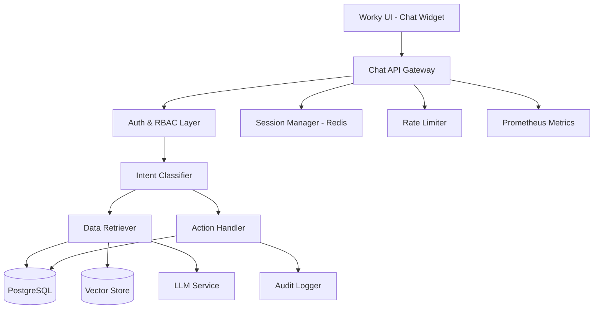

# Design Document - Chat Assistant for Worky

## Overview

The Chat Assistant is a context-aware conversational AI system integrated into the Worky project management platform. It enables users to query project data using natural language, perform safe actions (view tasks, set reminders, update status), and receive intelligent responses while respecting role-based access control (RBAC) and data residency rules.

### Key Features

- Natural language query processing with intent recognition
- Retrieval-Augmented Generation (RAG) for accurate data retrieval
- RBAC enforcement at query and action levels
- Safe write operations (comments, reminders, status updates)
- Comprehensive audit logging and observability
- Multi-turn conversation support with context retention
- Rich UI responses with deep links and actionable elements

### Technology Stack

- **Backend**: FastAPI (Python 3.11+)
- **Database**: PostgreSQL (existing Worky database)
- **Vector Store**: pgvector extension for PostgreSQL (optional, for document embeddings)
- **LLM Integration**: OpenAI API or compatible endpoint (configurable)
- **Caching**: Redis for session management and rate limiting
- **Monitoring**: Prometheus metrics, structured JSON logging
- **Frontend**: React integration with existing Worky UI

## Architecture

### High-Level Architecture



### Component Interaction Flow

1. **User Query** → Chat Widget sends query to `/api/v1/chat` endpoint
2. **Authentication** → JWT token validated, user context extracted
3. **RBAC Check** → User's client_id and project access verified
4. **Intent Classification** → Query parsed to determine intent (query, action, navigation)
5. **Data Retrieval** → Relevant data fetched from PostgreSQL with access filters
6. **LLM Processing** → Retrieved data + query sent to LLM for response generation
7. **Response Formatting** → LLM output transformed to structured JSON with UI actions
8. **Audit Logging** → Query, actions, and results logged with request_id
9. **Response Delivery** → JSON response sent to UI with text, cards, and deep links

### Security Architecture

- **Authentication**: JWT token validation on every request
- **Authorization**: Client-level and project-level access enforcement
- **Input Sanitization**: Query length limits, SQL injection prevention
- **Rate Limiting**: Per-user request throttling (60 req/min)
- **PII Masking**: Sensitive data redacted in logs
- **Audit Trail**: Complete request/response logging with user context

## Components and Interfaces

### 1. Chat API Gateway

**Responsibility**: Main entry point for chat requests, handles routing and orchestration

**Endpoints**:

```python
POST /api/v1/chat
- Request: { query: str, session_id: str, context?: dict }
- Response: { status: str, message: str, data: dict, actions: list, metadata: dict }

GET /api/v1/chat/history/{session_id}
- Response: { messages: list, session_metadata: dict }

DELETE /api/v1/chat/session/{session_id}
- Response: { success: bool }

GET /api/v1/chat/health
- Response: { status: str, llm_available: bool, db_available: bool }
```

**Dependencies**:
- `app.core.security.get_current_user` for authentication
- `ChatService` for business logic
- `SessionManager` for conversation context

### 2. Intent Classifier

**Responsibility**: Parse user query and determine intent type and entities

**Intent Types**:
- `QUERY`: Information retrieval (e.g., "Show me tasks for Project X")
- `ACTION`: Perform operation (e.g., "Set reminder for task TSK-123")
- `NAVIGATION`: Request deep link (e.g., "Open bug BUG-456")
- `REPORT`: Generate insights (e.g., "Show task distribution by status")
- `CLARIFICATION`: Follow-up or ambiguous query

**Entity Extraction**:
- Project names/IDs (PRJ-xxx)
- Task IDs (TSK-xxx)
- User names
- Dates and time ranges
- Status values
- Priority levels

**Implementation**:
```python
class IntentClassifier:
    def classify(self, query: str, context: dict) -> Intent:
        # Use regex patterns + LLM for complex queries
        # Returns: Intent(type, entities, confidence)
```

### 3. Data Retriever

**Responsibility**: Fetch relevant data from PostgreSQL with RBAC enforcement

**Retrieval Strategies**:

1. **Structured Query**: Direct SQL queries for specific entities
   - Tasks by project, user, status
   - Projects by client
   - Bugs by severity, assignee

2. **Semantic Search**: Vector similarity for documentation (optional)
   - Long descriptions, comments
   - Requires pgvector extension

3. **Aggregate Queries**: Statistics and reports
   - Task counts by status
   - Completion rates
   - Phase distribution

**RBAC Enforcement**:
```python
class DataRetriever:
    async def retrieve(self, intent: Intent, user: User) -> dict:
        # Always filter by user.client_id
        # Check project access via user permissions
        # Apply soft-delete filters (is_deleted=False)
```

### 4. Action Handler

**Responsibility**: Execute safe write operations with validation

**Supported Actions**:


| Action | Description | Validation |
|--------|-------------|------------|
| `VIEW_ENTITY` | Generate deep link to entity | Entity exists, user has access |
| `SET_REMINDER` | Create reminder for task/bug | Valid date, user has project access |
| `UPDATE_STATUS` | Change task/bug status | Valid status transition, user is assignee or admin |
| `CREATE_COMMENT` | Add comment to entity | User has project access |
| `LINK_COMMIT` | Associate PR/commit with task | Valid PR ID, task exists |
| `SUGGEST_REPORT` | Generate report link | User has access to data scope |

**Rejected Actions** (return error):
- Delete project/task/user
- Change user roles
- Modify permissions
- Bulk operations without confirmation

**Implementation**:
```python
class ActionHandler:
    async def execute(self, action: Action, user: User, db: AsyncSession) -> ActionResult:
        # Validate action permissions
        # Execute database operation
        # Log to audit trail
        # Return result with confirmation
```

### 5. LLM Service

**Responsibility**: Interface with language model for response generation

**Configuration**:
```python
class LLMConfig:
    provider: str = "openai"  # or "azure", "anthropic", "local"
    model: str = "gpt-4"
    api_key: str = env("LLM_API_KEY")
    temperature: float = 0.3
    max_tokens: int = 1000
    timeout: int = 30
```

**Prompt Template**:
```
You are a helpful assistant for the Worky project management platform.

User Query: {query}

Retrieved Data:
{data}

Instructions:
- Answer based only on the provided data
- If data is insufficient, ask for clarification
- Format responses clearly with bullet points
- Suggest relevant actions when appropriate
- Do not make up information

Response:
```

**Response Parsing**:
- Extract structured data from LLM output
- Generate UI action metadata
- Handle errors and fallbacks

### 6. Session Manager

**Responsibility**: Maintain conversation context across multiple turns

**Storage**: Redis with TTL (30 minutes)

**Session Data**:
```python
class ChatSession:
    session_id: str
    user_id: str
    messages: List[Message]  # Last 10 messages
    context: dict  # Resolved entities, current project, etc.
    created_at: datetime
    last_activity: datetime
```

**Context Resolution**:
- Track mentioned entities (projects, tasks)
- Resolve pronouns ("it", "that task")
- Maintain conversation flow

### 7. Audit Logger

**Responsibility**: Record all chat interactions for compliance

**Log Schema**:
```python
class ChatAuditLog:
    id: UUID
    request_id: str
    user_id: str
    client_id: str
    session_id: str
    query: str  # PII masked
    intent_type: str
    entities_accessed: List[str]
    action_performed: Optional[str]
    action_result: Optional[str]
    response_summary: str
    timestamp: datetime
    ip_address: str
    user_agent: str
```

**Storage**: Dedicated `chat_audit_logs` table in PostgreSQL

**PII Masking**:
- Email addresses → `[EMAIL]`
- Phone numbers → `[PHONE]`
- Personal names in free text → `[NAME]`

### 8. Rate Limiter

**Responsibility**: Prevent abuse and ensure fair usage

**Strategy**: Token bucket algorithm via Redis

**Limits**:
- 60 requests per minute per user
- 1000 requests per hour per user
- Burst allowance: 10 requests

**Response on Limit Exceeded**:
```json
{
  "status": "error",
  "error": {
    "code": "RATE_LIMIT_EXCEEDED",
    "message": "Too many requests. Please try again in 30 seconds.",
    "retry_after": 30
  }
}
```

## Data Models

### Chat Message

```python
class ChatMessage(Base):
    __tablename__ = "chat_messages"
    
    id = Column(String(20), primary_key=True)
    session_id = Column(String(50), nullable=False, index=True)
    user_id = Column(String(20), ForeignKey("users.id"), nullable=False)
    role = Column(String(20), nullable=False)  # "user" or "assistant"
    content = Column(Text, nullable=False)
    intent_type = Column(String(50))
    entities = Column(JSON)
    actions = Column(JSON)
    created_at = Column(DateTime(timezone=True), server_default=func.now())
```

### Chat Audit Log

```python
class ChatAuditLog(Base):
    __tablename__ = "chat_audit_logs"
    
    id = Column(UUID(as_uuid=True), primary_key=True, default=uuid.uuid4)
    request_id = Column(String(50), nullable=False, unique=True, index=True)
    user_id = Column(String(20), ForeignKey("users.id"), nullable=False)
    client_id = Column(String(20), ForeignKey("clients.id"), nullable=False)
    session_id = Column(String(50), nullable=False, index=True)
    query = Column(Text, nullable=False)  # PII masked
    intent_type = Column(String(50))
    entities_accessed = Column(JSON)
    action_performed = Column(String(100))
    action_result = Column(String(20))  # "success", "failed", "denied"
    response_summary = Column(Text)
    timestamp = Column(DateTime(timezone=True), server_default=func.now(), index=True)
    ip_address = Column(String(45))
    user_agent = Column(Text)
```

### Reminder

```python
class Reminder(Base):
    __tablename__ = "reminders"
    
    id = Column(String(20), primary_key=True)
    user_id = Column(String(20), ForeignKey("users.id"), nullable=False)
    entity_type = Column(String(50), nullable=False)  # "task", "bug", "project"
    entity_id = Column(String(20), nullable=False)
    message = Column(Text)
    remind_at = Column(DateTime(timezone=True), nullable=False)
    is_sent = Column(Boolean, default=False)
    created_via = Column(String(20), default="chat")  # "chat", "ui", "api"
    created_at = Column(DateTime(timezone=True), server_default=func.now())
```

## Error Handling

### Error Categories

1. **Authentication Errors** (401)
   - Invalid or expired token
   - User not found

2. **Authorization Errors** (403)
   - Insufficient permissions
   - Access to restricted entity

3. **Validation Errors** (400)
   - Invalid query format
   - Missing required parameters
   - Query too long (>2000 chars)

4. **Rate Limit Errors** (429)
   - Too many requests

5. **Service Errors** (500, 503)
   - LLM service unavailable
   - Database connection failure
   - Timeout (>30 seconds)

### Error Response Format

```json
{
  "status": "error",
  "error": {
    "code": "ERROR_CODE",
    "message": "Human-readable error message",
    "details": {},
    "timestamp": "2025-11-28T10:30:00Z",
    "request_id": "req_abc123"
  }
}
```

### Fallback Strategies

- **LLM Unavailable**: Return structured data without natural language
- **Timeout**: Return partial results with timeout notice
- **Ambiguous Query**: Ask clarifying questions
- **No Results**: Suggest alternative queries or filters

## Testing Strategy

### Unit Tests

1. **Intent Classifier**
   - Test pattern matching for each intent type
   - Entity extraction accuracy
   - Edge cases (empty query, special characters)

2. **Data Retriever**
   - RBAC enforcement (client filtering, project access)
   - Query construction for different entity types
   - Soft-delete filtering

3. **Action Handler**
   - Permission validation for each action
   - Database transaction handling
   - Error scenarios (invalid entity, access denied)

4. **Session Manager**
   - Context retention across messages
   - Entity resolution from history
   - Session expiration

### Integration Tests

1. **End-to-End Query Flow**
   - User submits query → receives formatted response
   - Multi-turn conversation with context
   - Action execution and confirmation

2. **RBAC Enforcement**
   - User A cannot access User B's client data
   - Project-level access restrictions
   - Role-based action permissions

3. **Rate Limiting**
   - Verify limits are enforced
   - Test burst allowance
   - Retry-after header correctness

4. **Audit Logging**
   - All queries logged with correct metadata
   - PII masking applied
   - Action results recorded

### Performance Tests

1. **Response Latency**
   - Target: p95 < 3 seconds
   - Measure LLM call time separately
   - Database query optimization

2. **Concurrent Users**
   - Test 100 concurrent sessions
   - Redis session management under load
   - Rate limiter accuracy

3. **Large Result Sets**
   - Queries returning 100+ entities
   - Pagination handling
   - Response size limits

### Security Tests

1. **SQL Injection**
   - Test malicious query patterns
   - Verify parameterized queries

2. **Access Control Bypass**
   - Attempt to access other clients' data
   - Test project permission boundaries

3. **Token Manipulation**
   - Invalid JWT signatures
   - Expired tokens
   - Missing claims

## Monitoring and Observability

### Prometheus Metrics

```python
# Request metrics
chat_requests_total = Counter("chat_requests_total", "Total chat requests", ["intent_type", "status"])
chat_request_duration_seconds = Histogram("chat_request_duration_seconds", "Request duration")
chat_llm_call_duration_seconds = Histogram("chat_llm_call_duration_seconds", "LLM call duration")

# Error metrics
chat_errors_total = Counter("chat_errors_total", "Total errors", ["error_type"])
chat_rate_limit_exceeded_total = Counter("chat_rate_limit_exceeded_total", "Rate limit hits")

# Usage metrics
chat_active_sessions = Gauge("chat_active_sessions", "Active chat sessions")
chat_actions_executed_total = Counter("chat_actions_executed_total", "Actions executed", ["action_type"])
```

### Structured Logging

```python
logger.info(
    "Chat query processed",
    request_id=request_id,
    user_id=user.id,
    client_id=user.client_id,
    intent_type=intent.type,
    entities_count=len(intent.entities),
    response_time_ms=duration_ms,
    llm_tokens_used=tokens
)
```

### Dashboards

1. **Usage Dashboard**
   - Queries per hour/day
   - Top intent types
   - Active users
   - Session duration distribution

2. **Performance Dashboard**
   - Response time percentiles (p50, p95, p99)
   - LLM latency
   - Database query time
   - Error rate

3. **Security Dashboard**
   - Failed authentication attempts
   - Rate limit violations
   - Access denied events
   - Suspicious query patterns

## Deployment Considerations

### Environment Variables

```bash
# LLM Configuration
LLM_PROVIDER=openai
LLM_API_KEY=sk-...
LLM_MODEL=gpt-4
LLM_TEMPERATURE=0.3
LLM_MAX_TOKENS=1000
LLM_TIMEOUT=30

# Redis Configuration
REDIS_HOST=localhost
REDIS_PORT=6379
REDIS_DB=1
REDIS_PASSWORD=

# Chat Configuration
CHAT_RATE_LIMIT_PER_MINUTE=60
CHAT_SESSION_TTL_MINUTES=30
CHAT_MAX_QUERY_LENGTH=2000
CHAT_MAX_CONTEXT_MESSAGES=10

# Feature Flags
CHAT_ENABLE_VECTOR_SEARCH=false
CHAT_ENABLE_ACTIONS=true
CHAT_ENABLE_AUDIT_LOGGING=true
```

### Database Migrations

1. Create `chat_messages` table
2. Create `chat_audit_logs` table
3. Create `reminders` table
4. Add indexes for performance
5. (Optional) Enable pgvector extension

### Dependencies

```txt
# requirements.txt additions
openai>=1.0.0
redis>=5.0.0
tiktoken>=0.5.0  # Token counting
prometheus-client>=0.19.0
```

### Scaling Considerations

- **Horizontal Scaling**: Stateless API servers behind load balancer
- **Redis Clustering**: For high session volume
- **LLM Rate Limits**: Queue requests if provider has limits
- **Database Connection Pooling**: Async pool with max connections
- **Caching**: Cache frequent queries (project lists, user info)

## Future Enhancements

1. **Voice Input**: Speech-to-text integration
2. **Proactive Suggestions**: AI-driven task recommendations
3. **Multi-Language Support**: i18n for queries and responses
4. **Advanced Analytics**: Trend detection, anomaly alerts
5. **Workflow Automation**: Multi-step action sequences
6. **Integration with External Tools**: Slack, Teams notifications
7. **Custom Training**: Fine-tune model on Worky-specific terminology
8. **Collaborative Chat**: Team-wide chat rooms for projects
