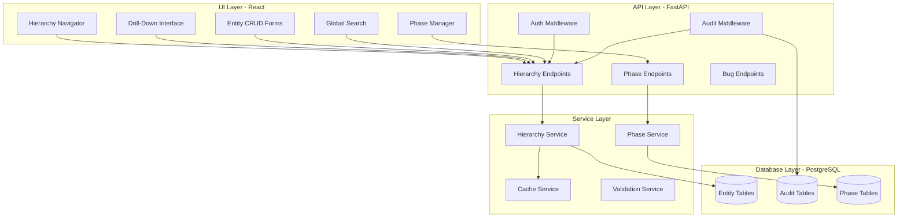

# Design Document: Hierarchical Work Breakdown Structure

## Overview

This design extends the existing Worky platform to support a comprehensive hierarchical work breakdown structure with eight core entities (Client, Program, Project, Use Case, User Story, Task, Subtask, Bug) and five user roles (Admin, Developer, Tester, Architect, Designer). The implementation adds drill-down navigation with a dynamic three-pane interface, Phase management, and comprehensive layer coverage across UI, Database, API, Logging, Security, and Monitoring.

### Key Design Principles

1. **Hierarchical Navigation**: Dynamic three-pane interface (main pane + parent context + children context)
2. **Role-Based Access**: Granular permissions based on user roles
3. **Phase Management**: Categorize work by activity type (Development, Analysis, Design, Testing)
4. **Multi-Client Support**: Complete data isolation between clients
5. **Comprehensive Auditing**: Immutable audit logs for all business changes
6. **Performance First**: Efficient caching and pagination strategies
7. **Integration Ready**: Seamless integration with existing Worky architecture

### Entity Hierarchy

```
Client (Top Level)
└── Program
    └── Project
        └── Use Case
            └── User Story
                └── Task
                    └── Subtask (Max Depth)

Bug (Can attach to any level)
```

## Architecture

### High-Level Component Architecture




## Technology Stack Extensions

| Component | Technology | Purpose |
|-----------|-----------|---------|
| State Management | Zustand | Hierarchy navigation state |
| Caching | React Query | Server state caching and invalidation |
| Drag & Drop | @dnd-kit | Reordering and organization |
| Tree View | react-arborist | Hierarchical tree visualization |
| Charts | Recharts | Phase distribution charts |
| Backend Cache | Redis | Entity caching (5-minute TTL) |
| Search | PostgreSQL Full-Text | Fast entity search |

## Components and Interfaces

### 1. UI Layer Components

#### 1.1 Hierarchy Navigator Component

**Purpose**: Main navigation interface with three-pane layout

**Directory**: `ui/src/components/hierarchy/HierarchyNavigator.jsx`

**Features**:
- Main pane: Current entity details
- Top context pane: Parent entity (resizable, 200-400px)
- Bottom context pane: Child entities (resizable, 200-400px)
- Breadcrumb navigation
- Quick actions (Add Child, Edit, Delete)

**State Management**:
```javascript
// Using Zustand for hierarchy navigation state
const useHierarchyStore = create((set) => ({
  currentEntity: null,
  parentEntity: null,
  childEntities: [],
  entityType: null,
  
  setCurrentEntity: (entity, type) => set({ 
    currentEntity: entity, 
    entityType: type 
  }),
  
  setParentEntity: (entity) => set({ parentEntity: entity }),
  
  setChildEntities: (entities) => set({ childEntities: entities }),
  
  navigateToEntity: async (entityId, entityType) => {
    // Load entity and update all panes
    const entity = await api.getEntity(entityType, entityId);
    const parent = await api.getParentEntity(entityType, entityId);
    const children = await api.getChildEntities(entityType, entityId);
    
    set({
      currentEntity: entity,
      parentEntity: parent,
      childEntities: children,
      entityType: entityType
    });
  }
}));
```


**Component Structure**:
```jsx
// ui/src/components/hierarchy/HierarchyNavigator.jsx
import { useState, useEffect } from 'react';
import { useHierarchyStore } from '../../stores/hierarchyStore';
import { Resizable } from 're-resizable';

export function HierarchyNavigator({ initialEntityId, initialEntityType }) {
  const {
    currentEntity,
    parentEntity,
    childEntities,
    entityType,
    navigateToEntity
  } = useHierarchyStore();
  
  const [topPaneHeight, setTopPaneHeight] = useState(250);
  const [bottomPaneHeight, setBottomPaneHeight] = useState(300);
  
  useEffect(() => {
    navigateToEntity(initialEntityId, initialEntityType);
  }, [initialEntityId, initialEntityType]);
  
  const handleParentClick = () => {
    if (parentEntity) {
      navigateToEntity(parentEntity.id, getParentType(entityType));
    }
  };
  
  const handleChildClick = (child) => {
    navigateToEntity(child.id, getChildType(entityType));
  };
  
  return (
    <div className="hierarchy-navigator">
      <Breadcrumb entity={currentEntity} type={entityType} />
      
      {/* Top Context Pane - Parent */}
      {parentEntity && (
        <Resizable
          size={{ height: topPaneHeight }}
          onResizeStop={(e, direction, ref, d) => {
            setTopPaneHeight(topPaneHeight + d.height);
          }}
          minHeight={150}
          maxHeight={600}
        >
          <div className="context-pane top-pane">
            <h3>Parent {getParentType(entityType)}</h3>
            <EntityCard 
              entity={parentEntity} 
              onClick={handleParentClick}
              type={getParentType(entityType)}
            />
          </div>
        </Resizable>
      )}
      
      {/* Main Pane - Current Entity */}
      <div className="main-pane">
        <EntityDetails entity={currentEntity} type={entityType} />
        <EntityActions entity={currentEntity} type={entityType} />
        <EntityStatistics entity={currentEntity} type={entityType} />
      </div>
      
      {/* Bottom Context Pane - Children */}
      {entityType !== 'Subtask' && (
        <Resizable
          size={{ height: bottomPaneHeight }}
          onResizeStop={(e, direction, ref, d) => {
            setBottomPaneHeight(bottomPaneHeight + d.height);
          }}
          minHeight={150}
          maxHeight={600}
        >
          <div className="context-pane bottom-pane">
            <div className="pane-header">
              <h3>{getChildType(entityType)}s</h3>
              <button onClick={() => openCreateChildModal()}>
                + Add {getChildType(entityType)}
              </button>
            </div>
            <EntityList 
              entities={childEntities}
              onEntityClick={handleChildClick}
              type={getChildType(entityType)}
            />
          </div>
        </Resizable>
      )}
    </div>
  );
}
```


#### 1.2 Global Search Component

**Purpose**: Search across all entity types with hierarchy path display

**Directory**: `ui/src/components/hierarchy/GlobalSearch.jsx`

```jsx
import { useState, useEffect } from 'react';
import { useDebounce } from '../../hooks/useDebounce';
import { api } from '../../services/api';

export function GlobalSearch() {
  const [query, setQuery] = useState('');
  const [results, setResults] = useState([]);
  const [loading, setLoading] = useState(false);
  const debouncedQuery = useDebounce(query, 300);
  
  useEffect(() => {
    if (debouncedQuery.length >= 2) {
      searchEntities(debouncedQuery);
    } else {
      setResults([]);
    }
  }, [debouncedQuery]);
  
  const searchEntities = async (searchQuery) => {
    setLoading(true);
    try {
      const response = await api.searchEntities(searchQuery);
      setResults(response.data);
    } finally {
      setLoading(false);
    }
  };
  
  const handleResultClick = (result) => {
    // Navigate to entity in hierarchy navigator
    window.location.href = `/hierarchy/${result.entity_type}/${result.id}`;
  };
  
  return (
    <div className="global-search">
      <input
        type="text"
        placeholder="Search clients, programs, projects, use cases, stories, tasks..."
        value={query}
        onChange={(e) => setQuery(e.target.value)}
        className="search-input"
      />
      
      {loading && <div className="search-loading">Searching...</div>}
      
      {results.length > 0 && (
        <div className="search-results">
          {results.map(result => (
            <div 
              key={`${result.entity_type}-${result.id}`}
              className="search-result-item"
              onClick={() => handleResultClick(result)}
            >
              <div className="result-type">{result.entity_type}</div>
              <div className="result-name">{result.name}</div>
              <div className="result-path">{result.hierarchy_path}</div>
              <div className="result-status">{result.status}</div>
            </div>
          ))}
        </div>
      )}
    </div>
  );
}
```


#### 1.3 Phase Management Component

**Purpose**: Admin interface for managing phases

**Directory**: `ui/src/components/admin/PhaseManager.jsx`

```jsx
import { useState, useEffect } from 'react';
import { api } from '../../services/api';
import { useAuth } from '../../contexts/AuthContext';

export function PhaseManager() {
  const { user } = useAuth();
  const [phases, setPhases] = useState([]);
  const [editingPhase, setEditingPhase] = useState(null);
  
  useEffect(() => {
    loadPhases();
  }, []);
  
  const loadPhases = async () => {
    const response = await api.getPhases();
    setPhases(response.data);
  };
  
  const handleCreatePhase = async (phaseData) => {
    await api.createPhase(phaseData);
    loadPhases();
  };
  
  const handleUpdatePhase = async (phaseId, phaseData) => {
    await api.updatePhase(phaseId, phaseData);
    loadPhases();
    setEditingPhase(null);
  };
  
  const handleDeactivatePhase = async (phaseId) => {
    if (confirm('Are you sure you want to deactivate this phase?')) {
      await api.deactivatePhase(phaseId);
      loadPhases();
    }
  };
  
  if (user.role !== 'Admin') {
    return <div>Access Denied: Admin role required</div>;
  }
  
  return (
    <div className="phase-manager">
      <h2>Phase Management</h2>
      
      <button onClick={() => setEditingPhase({ name: '', description: '', color: '#4A90E2', is_active: true })}>
        + Create New Phase
      </button>
      
      <table className="phases-table">
        <thead>
          <tr>
            <th>Name</th>
            <th>Description</th>
            <th>Color</th>
            <th>Status</th>
            <th>Usage Count</th>
            <th>Actions</th>
          </tr>
        </thead>
        <tbody>
          {phases.map(phase => (
            <tr key={phase.id}>
              <td>
                <span style={{ color: phase.color }}>●</span> {phase.name}
              </td>
              <td>{phase.description}</td>
              <td>
                <input type="color" value={phase.color} disabled />
              </td>
              <td>{phase.is_active ? 'Active' : 'Inactive'}</td>
              <td>{phase.usage_count}</td>
              <td>
                <button onClick={() => setEditingPhase(phase)}>Edit</button>
                {phase.usage_count === 0 && (
                  <button onClick={() => handleDeactivatePhase(phase.id)}>
                    Deactivate
                  </button>
                )}
              </td>
            </tr>
          ))}
        </tbody>
      </table>
      
      {editingPhase && (
        <PhaseForm
          phase={editingPhase}
          onSave={editingPhase.id ? handleUpdatePhase : handleCreatePhase}
          onCancel={() => setEditingPhase(null)}
        />
      )}
    </div>
  );
}
```


#### 1.4 Entity Statistics Component

**Purpose**: Display rollup statistics and phase distribution

**Directory**: `ui/src/components/hierarchy/EntityStatistics.jsx`

```jsx
import { PieChart, Pie, Cell, BarChart, Bar, XAxis, YAxis, Tooltip, Legend } from 'recharts';

export function EntityStatistics({ entity, type }) {
  const [stats, setStats] = useState(null);
  
  useEffect(() => {
    loadStatistics();
  }, [entity.id, type]);
  
  const loadStatistics = async () => {
    const response = await api.getEntityStatistics(type, entity.id);
    setStats(response.data);
  };
  
  if (!stats) return <div>Loading statistics...</div>;
  
  const statusColors = {
    'Not Started': '#95a5a6',
    'In Progress': '#3498db',
    'Completed': '#2ecc71',
    'Blocked': '#e74c3c'
  };
  
  const phaseColors = {
    'Development': '#3498db',
    'Analysis': '#9b59b6',
    'Design': '#e67e22',
    'Testing': '#1abc9c'
  };
  
  return (
    <div className="entity-statistics">
      <h3>Statistics</h3>
      
      {/* Status Distribution */}
      <div className="stat-section">
        <h4>Status Distribution</h4>
        <div className="stat-summary">
          {Object.entries(stats.status_counts).map(([status, count]) => (
            <div key={status} className="stat-item">
              <span className="stat-label">{status}:</span>
              <span className="stat-value">{count}</span>
            </div>
          ))}
        </div>
        
        <div className="progress-bar">
          <div 
            className="progress-fill" 
            style={{ width: `${stats.completion_percentage}%` }}
          >
            {stats.completion_percentage}% Complete
          </div>
        </div>
      </div>
      
      {/* Phase Distribution (for User Stories and above) */}
      {stats.phase_distribution && (
        <div className="stat-section">
          <h4>Phase Distribution</h4>
          <PieChart width={300} height={300}>
            <Pie
              data={stats.phase_distribution}
              dataKey="count"
              nameKey="phase"
              cx="50%"
              cy="50%"
              outerRadius={80}
              label
            >
              {stats.phase_distribution.map((entry, index) => (
                <Cell key={`cell-${index}`} fill={phaseColors[entry.phase]} />
              ))}
            </Pie>
            <Tooltip />
            <Legend />
          </PieChart>
        </div>
      )}
      
      {/* Rollup Counts */}
      <div className="stat-section">
        <h4>Hierarchy Rollup</h4>
        <table className="rollup-table">
          <tbody>
            {stats.rollup_counts && Object.entries(stats.rollup_counts).map(([entityType, count]) => (
              <tr key={entityType}>
                <td>{entityType}s:</td>
                <td>{count}</td>
              </tr>
            ))}
          </tbody>
        </table>
      </div>
    </div>
  );
}
```


### 2. API Layer Design

#### 2.1 Hierarchy Endpoints

**Base Path**: `/api/v1/hierarchy`

**Endpoints**:

```python
# api/app/api/v1/endpoints/hierarchy.py
from fastapi import APIRouter, Depends, Query, HTTPException
from typing import Optional, List
from app.core.security import get_current_user, require_role
from app.services.hierarchy_service import HierarchyService
from app.schemas.hierarchy import *

router = APIRouter()

# Generic entity retrieval
@router.get("/{entity_type}/{entity_id}")
async def get_entity(
    entity_type: str,
    entity_id: str,
    current_user: User = Depends(get_current_user)
):
    """Get entity details with parent and children"""
    service = HierarchyService()
    
    # Validate entity type
    valid_types = ['client', 'program', 'project', 'usecase', 'userstory', 'task', 'subtask']
    if entity_type.lower() not in valid_types:
        raise HTTPException(status_code=400, detail="Invalid entity type")
    
    # Get entity with context
    entity = await service.get_entity_with_context(
        entity_type=entity_type,
        entity_id=entity_id,
        user=current_user
    )
    
    return {
        "entity": entity,
        "parent": await service.get_parent_entity(entity_type, entity_id),
        "children": await service.get_child_entities(entity_type, entity_id),
        "breadcrumb": await service.get_breadcrumb(entity_type, entity_id)
    }

# Client endpoints
@router.get("/clients")
async def list_clients(
    page: int = Query(1, ge=1),
    page_size: int = Query(50, ge=1, le=100),
    current_user: User = Depends(get_current_user)
):
    """List all clients (filtered by user's client if not Admin)"""
    service = HierarchyService()
    return await service.list_clients(current_user, page, page_size)

@router.post("/clients")
async def create_client(
    client_data: ClientCreate,
    current_user: User = Depends(require_role(['Admin']))
):
    """Create new client (Admin only)"""
    service = HierarchyService()
    return await service.create_client(client_data, current_user)

@router.put("/clients/{client_id}")
async def update_client(
    client_id: str,
    client_data: ClientUpdate,
    current_user: User = Depends(require_role(['Admin']))
):
    """Update client (Admin only)"""
    service = HierarchyService()
    return await service.update_client(client_id, client_data, current_user)

# Program endpoints
@router.get("/clients/{client_id}/programs")
async def list_programs(
    client_id: str,
    page: int = Query(1, ge=1),
    page_size: int = Query(50, ge=1, le=100),
    current_user: User = Depends(get_current_user)
):
    """List programs for a client"""
    service = HierarchyService()
    return await service.list_programs(client_id, current_user, page, page_size)

@router.post("/programs")
async def create_program(
    program_data: ProgramCreate,
    current_user: User = Depends(require_role(['Admin', 'Architect']))
):
    """Create new program"""
    service = HierarchyService()
    return await service.create_program(program_data, current_user)

# Project endpoints
@router.get("/programs/{program_id}/projects")
async def list_projects(
    program_id: str,
    page: int = Query(1, ge=1),
    page_size: int = Query(50, ge=1, le=100),
    current_user: User = Depends(get_current_user)
):
    """List projects for a program"""
    service = HierarchyService()
    return await service.list_projects(program_id, current_user, page, page_size)

@router.post("/projects")
async def create_project(
    project_data: ProjectCreate,
    current_user: User = Depends(require_role(['Admin', 'Architect']))
):
    """Create new project"""
    service = HierarchyService()
    return await service.create_project(project_data, current_user)

# Use Case endpoints
@router.get("/projects/{project_id}/usecases")
async def list_usecases(
    project_id: str,
    page: int = Query(1, ge=1),
    page_size: int = Query(50, ge=1, le=100),
    current_user: User = Depends(get_current_user)
):
    """List use cases for a project"""
    service = HierarchyService()
    return await service.list_usecases(project_id, current_user, page, page_size)

@router.post("/usecases")
async def create_usecase(
    usecase_data: UseCaseCreate,
    current_user: User = Depends(require_role(['Admin', 'Architect', 'Designer']))
):
    """Create new use case"""
    service = HierarchyService()
    return await service.create_usecase(usecase_data, current_user)

# User Story endpoints
@router.get("/usecases/{usecase_id}/userstories")
async def list_user_stories(
    usecase_id: str,
    page: int = Query(1, ge=1),
    page_size: int = Query(50, ge=1, le=100),
    current_user: User = Depends(get_current_user)
):
    """List user stories for a use case"""
    service = HierarchyService()
    return await service.list_user_stories(usecase_id, current_user, page, page_size)

@router.post("/userstories")
async def create_user_story(
    story_data: UserStoryCreate,
    current_user: User = Depends(require_role(['Admin', 'Architect', 'Designer']))
):
    """Create new user story"""
    service = HierarchyService()
    return await service.create_user_story(story_data, current_user)

# Task endpoints
@router.get("/userstories/{story_id}/tasks")
async def list_tasks(
    story_id: str,
    page: int = Query(1, ge=1),
    page_size: int = Query(50, ge=1, le=100),
    phase: Optional[str] = None,
    status: Optional[str] = None,
    current_user: User = Depends(get_current_user)
):
    """List tasks for a user story"""
    service = HierarchyService()
    return await service.list_tasks(
        story_id, current_user, page, page_size, phase, status
    )

@router.post("/tasks")
async def create_task(
    task_data: TaskCreate,
    current_user: User = Depends(get_current_user)
):
    """Create new task"""
    service = HierarchyService()
    return await service.create_task(task_data, current_user)

# Subtask endpoints
@router.get("/tasks/{task_id}/subtasks")
async def list_subtasks(
    task_id: str,
    page: int = Query(1, ge=1),
    page_size: int = Query(50, ge=1, le=100),
    current_user: User = Depends(get_current_user)
):
    """List subtasks for a task"""
    service = HierarchyService()
    return await service.list_subtasks(task_id, current_user, page, page_size)

@router.post("/subtasks")
async def create_subtask(
    subtask_data: SubtaskCreate,
    current_user: User = Depends(get_current_user)
):
    """Create new subtask"""
    service = HierarchyService()
    
    # Validate that parent is a Task, not another Subtask
    parent_task = await service.get_task(subtask_data.task_id)
    if not parent_task:
        raise HTTPException(status_code=400, detail="Parent task not found")
    
    return await service.create_subtask(subtask_data, current_user)

# Statistics endpoint
@router.get("/{entity_type}/{entity_id}/statistics")
async def get_entity_statistics(
    entity_type: str,
    entity_id: str,
    current_user: User = Depends(get_current_user)
):
    """Get statistics for an entity including rollup counts and phase distribution"""
    service = HierarchyService()
    return await service.get_entity_statistics(entity_type, entity_id, current_user)

# Search endpoint
@router.get("/search")
async def search_entities(
    q: str = Query(..., min_length=2),
    entity_types: Optional[List[str]] = Query(None),
    page: int = Query(1, ge=1),
    page_size: int = Query(50, ge=1, le=100),
    current_user: User = Depends(get_current_user)
):
    """Global search across all entity types"""
    service = HierarchyService()
    return await service.search_entities(
        query=q,
        entity_types=entity_types,
        user=current_user,
        page=page,
        page_size=page_size
    )
```


#### 2.2 Phase Management Endpoints

**Base Path**: `/api/v1/phases`

```python
# api/app/api/v1/endpoints/phases.py
from fastapi import APIRouter, Depends, HTTPException
from app.core.security import get_current_user, require_role
from app.services.phase_service import PhaseService
from app.schemas.phase import PhaseCreate, PhaseUpdate

router = APIRouter()

@router.get("/")
async def list_phases(
    include_inactive: bool = False,
    current_user: User = Depends(get_current_user)
):
    """List all phases"""
    service = PhaseService()
    return await service.list_phases(include_inactive)

@router.post("/")
async def create_phase(
    phase_data: PhaseCreate,
    current_user: User = Depends(require_role(['Admin']))
):
    """Create new phase (Admin only)"""
    service = PhaseService()
    return await service.create_phase(phase_data, current_user)

@router.put("/{phase_id}")
async def update_phase(
    phase_id: str,
    phase_data: PhaseUpdate,
    current_user: User = Depends(require_role(['Admin']))
):
    """Update phase (Admin only)"""
    service = PhaseService()
    return await service.update_phase(phase_id, phase_data, current_user)

@router.post("/{phase_id}/deactivate")
async def deactivate_phase(
    phase_id: str,
    current_user: User = Depends(require_role(['Admin']))
):
    """Deactivate phase (Admin only)"""
    service = PhaseService()
    
    # Check if phase is in use
    usage_count = await service.get_phase_usage_count(phase_id)
    if usage_count > 0:
        raise HTTPException(
            status_code=400,
            detail=f"Cannot deactivate phase: {usage_count} tasks/subtasks are using it"
        )
    
    return await service.deactivate_phase(phase_id, current_user)

@router.get("/{phase_id}/usage")
async def get_phase_usage(
    phase_id: str,
    current_user: User = Depends(get_current_user)
):
    """Get usage statistics for a phase"""
    service = PhaseService()
    return await service.get_phase_usage(phase_id)
```


#### 2.3 Bug Management Endpoints

**Base Path**: `/api/v1/bugs`

```python
# api/app/api/v1/endpoints/bugs.py
from fastapi import APIRouter, Depends, Query
from typing import Optional
from app.core.security import get_current_user
from app.services.bug_service import BugService
from app.schemas.bug import BugCreate, BugUpdate

router = APIRouter()

@router.get("/")
async def list_bugs(
    entity_type: Optional[str] = None,
    entity_id: Optional[str] = None,
    severity: Optional[str] = None,
    status: Optional[str] = None,
    assigned_to: Optional[str] = None,
    page: int = Query(1, ge=1),
    page_size: int = Query(50, ge=1, le=100),
    current_user: User = Depends(get_current_user)
):
    """List bugs with optional filters"""
    service = BugService()
    return await service.list_bugs(
        entity_type=entity_type,
        entity_id=entity_id,
        severity=severity,
        status=status,
        assigned_to=assigned_to,
        user=current_user,
        page=page,
        page_size=page_size
    )

@router.post("/")
async def create_bug(
    bug_data: BugCreate,
    current_user: User = Depends(get_current_user)
):
    """Create new bug"""
    service = BugService()
    return await service.create_bug(bug_data, current_user)

@router.put("/{bug_id}")
async def update_bug(
    bug_id: str,
    bug_data: BugUpdate,
    current_user: User = Depends(get_current_user)
):
    """Update bug"""
    service = BugService()
    return await service.update_bug(bug_id, bug_data, current_user)

@router.post("/{bug_id}/assign")
async def assign_bug(
    bug_id: str,
    assignee_id: str,
    current_user: User = Depends(get_current_user)
):
    """Assign bug to user"""
    service = BugService()
    return await service.assign_bug(bug_id, assignee_id, current_user)

@router.post("/{bug_id}/resolve")
async def resolve_bug(
    bug_id: str,
    resolution_notes: str,
    current_user: User = Depends(get_current_user)
):
    """Mark bug as resolved"""
    service = BugService()
    return await service.resolve_bug(bug_id, resolution_notes, current_user)
```


### 3. Service Layer Design

#### 3.1 Hierarchy Service

**Purpose**: Business logic for hierarchy operations

**File**: `api/app/services/hierarchy_service.py`

```python
from sqlalchemy.ext.asyncio import AsyncSession
from sqlalchemy import select, func, and_, or_
from typing import Optional, List, Dict
from app.models.hierarchy import Client, Program, Project, UseCase, UserStory, Task, Subtask
from app.core.cache import cache_service
from app.core.exceptions import WorkyException

class HierarchyService:
    def __init__(self, db: AsyncSession):
        self.db = db
        self.cache = cache_service
    
    async def get_entity_with_context(
        self, 
        entity_type: str, 
        entity_id: str, 
        user: User
    ) -> Dict:
        """Get entity with parent and children context"""
        
        # Check cache first
        cache_key = f"entity:{entity_type}:{entity_id}"
        cached = await self.cache.get(cache_key)
        if cached:
            return cached
        
        # Get entity
        model = self._get_model_class(entity_type)
        entity = await self.db.get(model, entity_id)
        
        if not entity:
            raise WorkyException(
                code="ENTITY_NOT_FOUND",
                message=f"{entity_type} with ID {entity_id} not found",
                status_code=404
            )
        
        # Verify user has access (client-level isolation)
        if not await self._user_has_access(user, entity):
            raise WorkyException(
                code="ACCESS_DENIED",
                message="You do not have access to this entity",
                status_code=403
            )
        
        result = {
            "entity": entity,
            "parent": await self.get_parent_entity(entity_type, entity_id),
            "children": await self.get_child_entities(entity_type, entity_id),
            "breadcrumb": await self.get_breadcrumb(entity_type, entity_id)
        }
        
        # Cache for 5 minutes
        await self.cache.set(cache_key, result, ttl=300)
        
        return result
    
    async def get_parent_entity(self, entity_type: str, entity_id: str) -> Optional[Dict]:
        """Get parent entity"""
        model = self._get_model_class(entity_type)
        entity = await self.db.get(model, entity_id)
        
        if not entity:
            return None
        
        parent_field = self._get_parent_field(entity_type)
        if not parent_field:
            return None  # Top-level entity (Client)
        
        parent_id = getattr(entity, parent_field)
        if not parent_id:
            return None
        
        parent_model = self._get_parent_model_class(entity_type)
        parent = await self.db.get(parent_model, parent_id)
        
        return self._entity_to_dict(parent)
    
    async def get_child_entities(
        self, 
        entity_type: str, 
        entity_id: str,
        page: int = 1,
        page_size: int = 50
    ) -> List[Dict]:
        """Get child entities with pagination"""
        
        if entity_type.lower() == 'subtask':
            return []  # Subtasks have no children
        
        child_model = self._get_child_model_class(entity_type)
        parent_field = self._get_parent_field_for_child(entity_type)
        
        query = select(child_model).where(
            getattr(child_model, parent_field) == entity_id
        ).offset((page - 1) * page_size).limit(page_size)
        
        result = await self.db.execute(query)
        children = result.scalars().all()
        
        return [self._entity_to_dict(child) for child in children]
    
    async def get_breadcrumb(self, entity_type: str, entity_id: str) -> List[Dict]:
        """Get breadcrumb trail from Client to current entity"""
        breadcrumb = []
        current_type = entity_type
        current_id = entity_id
        
        while current_type:
            model = self._get_model_class(current_type)
            entity = await self.db.get(model, current_id)
            
            if not entity:
                break
            
            breadcrumb.insert(0, {
                "type": current_type,
                "id": entity.id,
                "name": entity.name
            })
            
            # Move to parent
            parent_field = self._get_parent_field(current_type)
            if not parent_field:
                break
            
            current_id = getattr(entity, parent_field)
            current_type = self._get_parent_type(current_type)
        
        return breadcrumb
    
    async def get_entity_statistics(
        self, 
        entity_type: str, 
        entity_id: str,
        user: User
    ) -> Dict:
        """Get statistics including status counts, phase distribution, and rollup counts"""
        
        # Get direct children status counts
        status_counts = await self._get_status_counts(entity_type, entity_id)
        
        # Get phase distribution (for User Story and above)
        phase_distribution = None
        if entity_type.lower() in ['userstory', 'usecase', 'project', 'program', 'client']:
            phase_distribution = await self._get_phase_distribution(entity_type, entity_id)
        
        # Get rollup counts (all descendants)
        rollup_counts = await self._get_rollup_counts(entity_type, entity_id)
        
        # Calculate completion percentage
        total = sum(status_counts.values())
        completed = status_counts.get('Completed', 0)
        completion_percentage = (completed / total * 100) if total > 0 else 0
        
        return {
            "status_counts": status_counts,
            "phase_distribution": phase_distribution,
            "rollup_counts": rollup_counts,
            "completion_percentage": round(completion_percentage, 1)
        }
    
    async def search_entities(
        self,
        query: str,
        entity_types: Optional[List[str]],
        user: User,
        page: int = 1,
        page_size: int = 50
    ) -> Dict:
        """Search across all entity types using PostgreSQL full-text search"""
        
        results = []
        
        # Define entity types to search
        types_to_search = entity_types or [
            'client', 'program', 'project', 'usecase', 'userstory', 'task', 'subtask'
        ]
        
        for entity_type in types_to_search:
            model = self._get_model_class(entity_type)
            
            # Build search query
            search_query = select(model).where(
                or_(
                    model.name.ilike(f"%{query}%"),
                    model.description.ilike(f"%{query}%") if hasattr(model, 'description') else False
                )
            )
            
            # Apply client-level filtering
            if user.role != 'Admin':
                search_query = self._apply_client_filter(search_query, model, user.client_id)
            
            search_query = search_query.limit(page_size)
            
            result = await self.db.execute(search_query)
            entities = result.scalars().all()
            
            for entity in entities:
                breadcrumb = await self.get_breadcrumb(entity_type, entity.id)
                hierarchy_path = " > ".join([b["name"] for b in breadcrumb])
                
                results.append({
                    "entity_type": entity_type,
                    "id": entity.id,
                    "name": entity.name,
                    "status": entity.status if hasattr(entity, 'status') else None,
                    "hierarchy_path": hierarchy_path
                })
        
        return {
            "results": results,
            "total": len(results),
            "page": page,
            "page_size": page_size
        }
    
    # Helper methods
    def _get_model_class(self, entity_type: str):
        """Map entity type string to model class"""
        mapping = {
            'client': Client,
            'program': Program,
            'project': Project,
            'usecase': UseCase,
            'userstory': UserStory,
            'task': Task,
            'subtask': Subtask
        }
        return mapping.get(entity_type.lower())
    
    def _get_parent_field(self, entity_type: str) -> Optional[str]:
        """Get the parent foreign key field name"""
        mapping = {
            'program': 'client_id',
            'project': 'program_id',
            'usecase': 'project_id',
            'userstory': 'usecase_id',
            'task': 'userstory_id',
            'subtask': 'task_id'
        }
        return mapping.get(entity_type.lower())
    
    def _entity_to_dict(self, entity) -> Dict:
        """Convert SQLAlchemy model to dictionary"""
        if not entity:
            return None
        return {c.name: getattr(entity, c.name) for c in entity.__table__.columns}
    
    async def _user_has_access(self, user: User, entity) -> bool:
        """Check if user has access to entity based on client isolation"""
        if user.role == 'Admin':
            return True
        
        # Get entity's client_id by traversing up the hierarchy
        entity_client_id = await self._get_entity_client_id(entity)
        return entity_client_id == user.client_id
    
    async def _get_status_counts(self, entity_type: str, entity_id: str) -> Dict[str, int]:
        """Get status counts for direct children"""
        child_model = self._get_child_model_class(entity_type)
        if not child_model or not hasattr(child_model, 'status'):
            return {}
        
        parent_field = self._get_parent_field_for_child(entity_type)
        
        query = select(
            child_model.status,
            func.count(child_model.id)
        ).where(
            getattr(child_model, parent_field) == entity_id
        ).group_by(child_model.status)
        
        result = await self.db.execute(query)
        return dict(result.all())
    
    async def _get_phase_distribution(self, entity_type: str, entity_id: str) -> List[Dict]:
        """Get phase distribution for all descendant tasks/subtasks"""
        # Implementation would recursively get all tasks/subtasks
        # and count by phase
        pass
    
    async def _get_rollup_counts(self, entity_type: str, entity_id: str) -> Dict[str, int]:
        """Get counts of all descendant entities by type"""
        # Implementation would recursively count all descendants
        pass
```


## Data Models

### Database Schema

#### Core Entity Tables

**clients**
```sql
CREATE TABLE clients (
    id UUID PRIMARY KEY DEFAULT gen_random_uuid(),
    name VARCHAR(255) NOT NULL,
    description TEXT,
    is_active BOOLEAN DEFAULT true,
    created_at TIMESTAMP WITH TIME ZONE DEFAULT NOW(),
    updated_at TIMESTAMP WITH TIME ZONE DEFAULT NOW(),
    created_by UUID REFERENCES users(id),
    updated_by UUID REFERENCES users(id)
);

CREATE INDEX idx_clients_is_active ON clients(is_active);
```

**programs**
```sql
CREATE TABLE programs (
    id UUID PRIMARY KEY DEFAULT gen_random_uuid(),
    client_id UUID NOT NULL REFERENCES clients(id) ON DELETE CASCADE,
    name VARCHAR(255) NOT NULL,
    description TEXT,
    start_date DATE,
    end_date DATE,
    status VARCHAR(50) DEFAULT 'Planning' CHECK (status IN ('Planning', 'Active', 'On Hold', 'Completed', 'Cancelled')),
    is_deleted BOOLEAN DEFAULT false,
    created_at TIMESTAMP WITH TIME ZONE DEFAULT NOW(),
    updated_at TIMESTAMP WITH TIME ZONE DEFAULT NOW(),
    created_by UUID REFERENCES users(id),
    updated_by UUID REFERENCES users(id)
);

CREATE INDEX idx_programs_client_id ON programs(client_id);
CREATE INDEX idx_programs_status ON programs(status);
CREATE INDEX idx_programs_is_deleted ON programs(is_deleted);
```

**projects**
```sql
CREATE TABLE projects (
    id UUID PRIMARY KEY DEFAULT gen_random_uuid(),
    program_id UUID NOT NULL REFERENCES programs(id) ON DELETE CASCADE,
    name VARCHAR(255) NOT NULL,
    description TEXT,
    start_date DATE,
    end_date DATE,
    status VARCHAR(50) DEFAULT 'Planning' CHECK (status IN ('Planning', 'Active', 'On Hold', 'Completed', 'Cancelled')),
    repository_url VARCHAR(500),
    is_deleted BOOLEAN DEFAULT false,
    created_at TIMESTAMP WITH TIME ZONE DEFAULT NOW(),
    updated_at TIMESTAMP WITH TIME ZONE DEFAULT NOW(),
    created_by UUID REFERENCES users(id),
    updated_by UUID REFERENCES users(id)
);

CREATE INDEX idx_projects_program_id ON projects(program_id);
CREATE INDEX idx_projects_status ON projects(status);
CREATE INDEX idx_projects_is_deleted ON projects(is_deleted);
```

**usecases**
```sql
CREATE TABLE usecases (
    id UUID PRIMARY KEY DEFAULT gen_random_uuid(),
    project_id UUID NOT NULL REFERENCES projects(id) ON DELETE CASCADE,
    name VARCHAR(255) NOT NULL,
    description TEXT,
    priority VARCHAR(20) DEFAULT 'Medium' CHECK (priority IN ('Critical', 'High', 'Medium', 'Low')),
    status VARCHAR(50) DEFAULT 'Draft' CHECK (status IN ('Draft', 'In Review', 'Approved', 'In Progress', 'Completed')),
    is_deleted BOOLEAN DEFAULT false,
    created_at TIMESTAMP WITH TIME ZONE DEFAULT NOW(),
    updated_at TIMESTAMP WITH TIME ZONE DEFAULT NOW(),
    created_by UUID REFERENCES users(id),
    updated_by UUID REFERENCES users(id)
);

CREATE INDEX idx_usecases_project_id ON usecases(project_id);
CREATE INDEX idx_usecases_status ON usecases(status);
CREATE INDEX idx_usecases_priority ON usecases(priority);
CREATE INDEX idx_usecases_is_deleted ON usecases(is_deleted);
```

**user_stories**
```sql
CREATE TABLE user_stories (
    id UUID PRIMARY KEY DEFAULT gen_random_uuid(),
    usecase_id UUID NOT NULL REFERENCES usecases(id) ON DELETE CASCADE,
    name VARCHAR(255) NOT NULL,
    description TEXT,
    acceptance_criteria TEXT,
    story_points INTEGER,
    priority VARCHAR(20) DEFAULT 'Medium' CHECK (priority IN ('Critical', 'High', 'Medium', 'Low')),
    status VARCHAR(50) DEFAULT 'Backlog' CHECK (status IN ('Backlog', 'Ready', 'In Progress', 'In Review', 'Done')),
    is_deleted BOOLEAN DEFAULT false,
    created_at TIMESTAMP WITH TIME ZONE DEFAULT NOW(),
    updated_at TIMESTAMP WITH TIME ZONE DEFAULT NOW(),
    created_by UUID REFERENCES users(id),
    updated_by UUID REFERENCES users(id)
);

CREATE INDEX idx_user_stories_usecase_id ON user_stories(usecase_id);
CREATE INDEX idx_user_stories_status ON user_stories(status);
CREATE INDEX idx_user_stories_priority ON user_stories(priority);
CREATE INDEX idx_user_stories_is_deleted ON user_stories(is_deleted);
```

**tasks**
```sql
CREATE TABLE tasks (
    id UUID PRIMARY KEY DEFAULT gen_random_uuid(),
    user_story_id UUID NOT NULL REFERENCES user_stories(id) ON DELETE CASCADE,
    title VARCHAR(255) NOT NULL,
    description TEXT,
    phase_id UUID NOT NULL REFERENCES phases(id),
    status VARCHAR(50) DEFAULT 'To Do' CHECK (status IN ('To Do', 'In Progress', 'In Review', 'Done', 'Blocked')),
    priority VARCHAR(20) DEFAULT 'Medium' CHECK (priority IN ('Critical', 'High', 'Medium', 'Low')),
    assigned_to UUID REFERENCES users(id) ON DELETE SET NULL,
    estimated_hours DECIMAL(10, 2),
    actual_hours DECIMAL(10, 2),
    start_date DATE,
    due_date DATE,
    completed_at TIMESTAMP WITH TIME ZONE,
    is_deleted BOOLEAN DEFAULT false,
    created_at TIMESTAMP WITH TIME ZONE DEFAULT NOW(),
    updated_at TIMESTAMP WITH TIME ZONE DEFAULT NOW(),
    created_by UUID REFERENCES users(id),
    updated_by UUID REFERENCES users(id)
);

CREATE INDEX idx_tasks_user_story_id ON tasks(user_story_id);
CREATE INDEX idx_tasks_phase_id ON tasks(phase_id);
CREATE INDEX idx_tasks_status ON tasks(status);
CREATE INDEX idx_tasks_assigned_to ON tasks(assigned_to);
CREATE INDEX idx_tasks_is_deleted ON tasks(is_deleted);
```

**subtasks**
```sql
CREATE TABLE subtasks (
    id UUID PRIMARY KEY DEFAULT gen_random_uuid(),
    task_id UUID NOT NULL REFERENCES tasks(id) ON DELETE CASCADE,
    title VARCHAR(255) NOT NULL,
    description TEXT,
    phase_id UUID NOT NULL REFERENCES phases(id),
    status VARCHAR(50) DEFAULT 'To Do' CHECK (status IN ('To Do', 'In Progress', 'Done', 'Blocked')),
    assigned_to UUID REFERENCES users(id) ON DELETE SET NULL,
    estimated_hours DECIMAL(10, 2),
    actual_hours DECIMAL(10, 2),
    completed_at TIMESTAMP WITH TIME ZONE,
    is_deleted BOOLEAN DEFAULT false,
    created_at TIMESTAMP WITH TIME ZONE DEFAULT NOW(),
    updated_at TIMESTAMP WITH TIME ZONE DEFAULT NOW(),
    created_by UUID REFERENCES users(id),
    updated_by UUID REFERENCES users(id),
    
    -- Constraint to prevent subtasks under subtasks
    CONSTRAINT chk_parent_is_task CHECK (
        task_id IN (SELECT id FROM tasks)
    )
);

CREATE INDEX idx_subtasks_task_id ON subtasks(task_id);
CREATE INDEX idx_subtasks_phase_id ON subtasks(phase_id);
CREATE INDEX idx_subtasks_status ON subtasks(status);
CREATE INDEX idx_subtasks_assigned_to ON subtasks(assigned_to);
CREATE INDEX idx_subtasks_is_deleted ON subtasks(is_deleted);
```

**phases**
```sql
CREATE TABLE phases (
    id UUID PRIMARY KEY DEFAULT gen_random_uuid(),
    name VARCHAR(100) NOT NULL UNIQUE,
    description TEXT,
    color VARCHAR(7) NOT NULL DEFAULT '#4A90E2',
    is_active BOOLEAN DEFAULT true,
    display_order INTEGER DEFAULT 0,
    created_at TIMESTAMP WITH TIME ZONE DEFAULT NOW(),
    updated_at TIMESTAMP WITH TIME ZONE DEFAULT NOW(),
    created_by UUID REFERENCES users(id),
    updated_by UUID REFERENCES users(id)
);

CREATE INDEX idx_phases_is_active ON phases(is_active);
CREATE INDEX idx_phases_display_order ON phases(display_order);

-- Insert default phases
INSERT INTO phases (name, description, color, display_order) VALUES
('Development', 'Software development and coding tasks', '#3498db', 1),
('Analysis', 'Requirements analysis and research tasks', '#9b59b6', 2),
('Design', 'UI/UX and architecture design tasks', '#e67e22', 3),
('Testing', 'Quality assurance and testing tasks', '#1abc9c', 4);
```

**bugs**
```sql
CREATE TABLE bugs (
    id UUID PRIMARY KEY DEFAULT gen_random_uuid(),
    entity_type VARCHAR(50) NOT NULL CHECK (entity_type IN ('Program', 'Project', 'UseCase', 'UserStory', 'Task', 'Subtask')),
    entity_id UUID NOT NULL,
    title VARCHAR(255) NOT NULL,
    description TEXT NOT NULL,
    severity VARCHAR(20) NOT NULL CHECK (severity IN ('Critical', 'High', 'Medium', 'Low')),
    priority VARCHAR(20) NOT NULL CHECK (priority IN ('P0', 'P1', 'P2', 'P3')),
    status VARCHAR(50) DEFAULT 'New' CHECK (status IN ('New', 'Assigned', 'In Progress', 'Fixed', 'Verified', 'Closed', 'Reopened')),
    assigned_to UUID REFERENCES users(id) ON DELETE SET NULL,
    reported_by UUID NOT NULL REFERENCES users(id),
    resolution_notes TEXT,
    is_deleted BOOLEAN DEFAULT false,
    created_at TIMESTAMP WITH TIME ZONE DEFAULT NOW(),
    updated_at TIMESTAMP WITH TIME ZONE DEFAULT NOW(),
    closed_at TIMESTAMP WITH TIME ZONE,
    created_by UUID REFERENCES users(id),
    updated_by UUID REFERENCES users(id)
);

CREATE INDEX idx_bugs_entity ON bugs(entity_type, entity_id);
CREATE INDEX idx_bugs_status ON bugs(status);
CREATE INDEX idx_bugs_severity ON bugs(severity);
CREATE INDEX idx_bugs_assigned_to ON bugs(assigned_to);
CREATE INDEX idx_bugs_reported_by ON bugs(reported_by);
CREATE INDEX idx_bugs_is_deleted ON bugs(is_deleted);
```


#### Audit Tables

**audit_logs**
```sql
CREATE TABLE audit_logs (
    id UUID PRIMARY KEY DEFAULT gen_random_uuid(),
    user_id UUID REFERENCES users(id) ON DELETE SET NULL,
    client_id UUID REFERENCES clients(id) ON DELETE SET NULL,
    entity_type VARCHAR(50) NOT NULL,
    entity_id UUID NOT NULL,
    action VARCHAR(100) NOT NULL CHECK (action IN ('CREATE', 'UPDATE', 'DELETE', 'VIEW')),
    changes JSONB,
    request_id VARCHAR(100),
    ip_address INET,
    user_agent TEXT,
    created_at TIMESTAMP WITH TIME ZONE DEFAULT NOW()
);

CREATE INDEX idx_audit_logs_user_id ON audit_logs(user_id);
CREATE INDEX idx_audit_logs_entity ON audit_logs(entity_type, entity_id);
CREATE INDEX idx_audit_logs_created_at ON audit_logs(created_at);
CREATE INDEX idx_audit_logs_action ON audit_logs(action);

-- Partition by month for better performance
CREATE TABLE audit_logs_y2025m01 PARTITION OF audit_logs
    FOR VALUES FROM ('2025-01-01') TO ('2025-02-01');
```

**entity_history**
```sql
CREATE TABLE entity_history (
    id UUID PRIMARY KEY DEFAULT gen_random_uuid(),
    entity_type VARCHAR(50) NOT NULL,
    entity_id UUID NOT NULL,
    field_name VARCHAR(100) NOT NULL,
    old_value TEXT,
    new_value TEXT,
    changed_by UUID REFERENCES users(id),
    changed_at TIMESTAMP WITH TIME ZONE DEFAULT NOW()
);

CREATE INDEX idx_entity_history_entity ON entity_history(entity_type, entity_id);
CREATE INDEX idx_entity_history_changed_at ON entity_history(changed_at);
```

### SQLAlchemy Models

**Base Model**
```python
# api/app/models/base.py
from sqlalchemy import Column, DateTime, Boolean, UUID
from sqlalchemy.ext.declarative import declarative_base
from sqlalchemy.sql import func
import uuid

Base = declarative_base()

class BaseModel(Base):
    __abstract__ = True
    
    id = Column(UUID(as_uuid=True), primary_key=True, default=uuid.uuid4)
    is_deleted = Column(Boolean, default=False, nullable=False)
    created_at = Column(DateTime(timezone=True), server_default=func.now())
    updated_at = Column(DateTime(timezone=True), onupdate=func.now())
    created_by = Column(UUID(as_uuid=True), ForeignKey('users.id'))
    updated_by = Column(UUID(as_uuid=True), ForeignKey('users.id'))
```

**Hierarchy Models**
```python
# api/app/models/hierarchy.py
from sqlalchemy import Column, String, Text, Date, ForeignKey, Integer, Numeric
from sqlalchemy.orm import relationship
from app.models.base import BaseModel

class Client(BaseModel):
    __tablename__ = 'clients'
    
    name = Column(String(255), nullable=False)
    description = Column(Text)
    is_active = Column(Boolean, default=True)
    
    # Relationships
    programs = relationship("Program", back_populates="client", cascade="all, delete-orphan")
    users = relationship("User", back_populates="client")

class Program(BaseModel):
    __tablename__ = 'programs'
    
    client_id = Column(UUID(as_uuid=True), ForeignKey('clients.id'), nullable=False)
    name = Column(String(255), nullable=False)
    description = Column(Text)
    start_date = Column(Date)
    end_date = Column(Date)
    status = Column(String(50), default='Planning')
    
    # Relationships
    client = relationship("Client", back_populates="programs")
    projects = relationship("Project", back_populates="program", cascade="all, delete-orphan")

class Project(BaseModel):
    __tablename__ = 'projects'
    
    program_id = Column(UUID(as_uuid=True), ForeignKey('programs.id'), nullable=False)
    name = Column(String(255), nullable=False)
    description = Column(Text)
    start_date = Column(Date)
    end_date = Column(Date)
    status = Column(String(50), default='Planning')
    repository_url = Column(String(500))
    
    # Relationships
    program = relationship("Program", back_populates="projects")
    usecases = relationship("UseCase", back_populates="project", cascade="all, delete-orphan")

class UseCase(BaseModel):
    __tablename__ = 'usecases'
    
    project_id = Column(UUID(as_uuid=True), ForeignKey('projects.id'), nullable=False)
    name = Column(String(255), nullable=False)
    description = Column(Text)
    priority = Column(String(20), default='Medium')
    status = Column(String(50), default='Draft')
    
    # Relationships
    project = relationship("Project", back_populates="usecases")
    user_stories = relationship("UserStory", back_populates="usecase", cascade="all, delete-orphan")

class UserStory(BaseModel):
    __tablename__ = 'user_stories'
    
    usecase_id = Column(UUID(as_uuid=True), ForeignKey('usecases.id'), nullable=False)
    name = Column(String(255), nullable=False)
    description = Column(Text)
    acceptance_criteria = Column(Text)
    story_points = Column(Integer)
    priority = Column(String(20), default='Medium')
    status = Column(String(50), default='Backlog')
    
    # Relationships
    usecase = relationship("UseCase", back_populates="user_stories")
    tasks = relationship("Task", back_populates="user_story", cascade="all, delete-orphan")

class Task(BaseModel):
    __tablename__ = 'tasks'
    
    user_story_id = Column(UUID(as_uuid=True), ForeignKey('user_stories.id'), nullable=False)
    title = Column(String(255), nullable=False)
    description = Column(Text)
    phase_id = Column(UUID(as_uuid=True), ForeignKey('phases.id'), nullable=False)
    status = Column(String(50), default='To Do')
    priority = Column(String(20), default='Medium')
    assigned_to = Column(UUID(as_uuid=True), ForeignKey('users.id'))
    estimated_hours = Column(Numeric(10, 2))
    actual_hours = Column(Numeric(10, 2))
    start_date = Column(Date)
    due_date = Column(Date)
    completed_at = Column(DateTime(timezone=True))
    
    # Relationships
    user_story = relationship("UserStory", back_populates="tasks")
    phase = relationship("Phase")
    assignee = relationship("User", foreign_keys=[assigned_to])
    subtasks = relationship("Subtask", back_populates="task", cascade="all, delete-orphan")

class Subtask(BaseModel):
    __tablename__ = 'subtasks'
    
    task_id = Column(UUID(as_uuid=True), ForeignKey('tasks.id'), nullable=False)
    title = Column(String(255), nullable=False)
    description = Column(Text)
    phase_id = Column(UUID(as_uuid=True), ForeignKey('phases.id'), nullable=False)
    status = Column(String(50), default='To Do')
    assigned_to = Column(UUID(as_uuid=True), ForeignKey('users.id'))
    estimated_hours = Column(Numeric(10, 2))
    actual_hours = Column(Numeric(10, 2))
    completed_at = Column(DateTime(timezone=True))
    
    # Relationships
    task = relationship("Task", back_populates="subtasks")
    phase = relationship("Phase")
    assignee = relationship("User", foreign_keys=[assigned_to])

class Phase(BaseModel):
    __tablename__ = 'phases'
    
    name = Column(String(100), nullable=False, unique=True)
    description = Column(Text)
    color = Column(String(7), nullable=False, default='#4A90E2')
    is_active = Column(Boolean, default=True)
    display_order = Column(Integer, default=0)

class Bug(BaseModel):
    __tablename__ = 'bugs'
    
    entity_type = Column(String(50), nullable=False)
    entity_id = Column(UUID(as_uuid=True), nullable=False)
    title = Column(String(255), nullable=False)
    description = Column(Text, nullable=False)
    severity = Column(String(20), nullable=False)
    priority = Column(String(20), nullable=False)
    status = Column(String(50), default='New')
    assigned_to = Column(UUID(as_uuid=True), ForeignKey('users.id'))
    reported_by = Column(UUID(as_uuid=True), ForeignKey('users.id'), nullable=False)
    resolution_notes = Column(Text)
    closed_at = Column(DateTime(timezone=True))
    
    # Relationships
    assignee = relationship("User", foreign_keys=[assigned_to])
    reporter = relationship("User", foreign_keys=[reported_by])
```


## Security and Access Control

### Role-Based Permissions Matrix

| Entity | Admin | Architect | Designer | Developer | Tester |
|--------|-------|-----------|----------|-----------|--------|
| **Client** | CRUD | R | R | R | R |
| **Program** | CRUD | CRUD | R | R | R |
| **Project** | CRUD | CRUD | R | R | R |
| **Use Case** | CRUD | CRUD | CRUD | R | R |
| **User Story** | CRUD | CRUD | CRUD | R | R |
| **Task** | CRUD | CRU (own) | CRU (own) | CRUD (own) | R |
| **Subtask** | CRUD | CRU (own) | CRU (own) | CRUD (own) | R |
| **Bug** | CRUD | R | R | CRUD | CRUD |
| **Phase** | CRUD | R | R | R | R |

Legend: C=Create, R=Read, U=Update, D=Delete, (own)=Only items assigned to user

### Client-Level Data Isolation

```python
# api/app/core/security.py
from fastapi import Depends, HTTPException
from sqlalchemy import select
from app.models.hierarchy import Client, Program, Project

async def enforce_client_isolation(
    entity_type: str,
    entity_id: str,
    user: User,
    db: AsyncSession
) -> bool:
    """Ensure user can only access entities within their client"""
    
    if user.role == 'Admin':
        return True  # Admin can access all clients
    
    # Get entity's client_id by traversing hierarchy
    client_id = await get_entity_client_id(entity_type, entity_id, db)
    
    if client_id != user.client_id:
        raise HTTPException(
            status_code=403,
            detail="Access denied: Entity belongs to different client"
        )
    
    return True

async def get_entity_client_id(
    entity_type: str,
    entity_id: str,
    db: AsyncSession
) -> UUID:
    """Traverse hierarchy to find client_id"""
    
    if entity_type == 'client':
        return entity_id
    
    # Map entity type to model and parent field
    hierarchy_map = {
        'program': (Program, 'client_id'),
        'project': (Project, 'program_id'),
        'usecase': (UseCase, 'project_id'),
        'userstory': (UserStory, 'usecase_id'),
        'task': (Task, 'user_story_id'),
        'subtask': (Subtask, 'task_id')
    }
    
    model, parent_field = hierarchy_map[entity_type]
    entity = await db.get(model, entity_id)
    
    if not entity:
        raise HTTPException(status_code=404, detail="Entity not found")
    
    # Recursively get parent's client_id
    parent_id = getattr(entity, parent_field)
    parent_type = get_parent_type(entity_type)
    
    return await get_entity_client_id(parent_type, parent_id, db)
```

### JWT Token Structure

```python
# Token payload structure
{
    "sub": "user_id",
    "email": "user@example.com",
    "role": "Developer",
    "client_id": "client_uuid",
    "exp": 1234567890,
    "iat": 1234567890
}
```

### API Security Middleware

```python
# api/app/middleware/auth_middleware.py
from starlette.middleware.base import BaseHTTPMiddleware
from fastapi import Request, HTTPException
from jose import jwt, JWTError
from app.core.config import settings

class AuthMiddleware(BaseHTTPMiddleware):
    async def dispatch(self, request: Request, call_next):
        # Skip auth for public endpoints
        if request.url.path in ['/health', '/docs', '/openapi.json']:
            return await call_next(request)
        
        # Extract token
        auth_header = request.headers.get('Authorization')
        if not auth_header or not auth_header.startswith('Bearer '):
            raise HTTPException(status_code=401, detail="Missing or invalid token")
        
        token = auth_header.split(' ')[1]
        
        try:
            # Verify token
            payload = jwt.decode(
                token,
                settings.SECRET_KEY,
                algorithms=[settings.ALGORITHM]
            )
            
            # Attach user info to request state
            request.state.user_id = payload.get('sub')
            request.state.user_role = payload.get('role')
            request.state.client_id = payload.get('client_id')
            
        except JWTError:
            raise HTTPException(status_code=401, detail="Invalid token")
        
        response = await call_next(request)
        return response
```


## Logging and Auditing

### Structured Logging Format

```python
# api/app/core/logging.py
import logging
import json
from datetime import datetime
from contextvars import ContextVar

request_id_var: ContextVar[str] = ContextVar('request_id', default='')
user_id_var: ContextVar[str] = ContextVar('user_id', default='')

class StructuredLogger:
    def __init__(self, service_name: str):
        self.service_name = service_name
        self.logger = logging.getLogger(service_name)
    
    def log_activity(self, action: str, entity_type: str, entity_id: str, **context):
        """Log user activity"""
        log_entry = {
            "timestamp": datetime.utcnow().isoformat() + "Z",
            "service": self.service_name,
            "log_type": "activity",
            "request_id": request_id_var.get(),
            "user_id": user_id_var.get(),
            "action": action,
            "entity_type": entity_type,
            "entity_id": entity_id,
            "context": context
        }
        self.logger.info(json.dumps(log_entry))
    
    def log_system(self, message: str, level: str = "INFO", **context):
        """Log system events"""
        log_entry = {
            "timestamp": datetime.utcnow().isoformat() + "Z",
            "service": self.service_name,
            "log_type": "system",
            "request_id": request_id_var.get(),
            "level": level,
            "message": message,
            "context": context
        }
        self.logger.log(getattr(logging, level), json.dumps(log_entry))

# Usage in endpoints
logger = StructuredLogger("worky-api")

@router.post("/projects")
async def create_project(project_data: ProjectCreate, current_user: User):
    project = await service.create_project(project_data, current_user)
    
    logger.log_activity(
        action="CREATE",
        entity_type="project",
        entity_id=str(project.id),
        project_name=project.name,
        program_id=str(project.program_id)
    )
    
    return project
```

### Audit Log Middleware

```python
# api/app/middleware/audit_middleware.py
from starlette.middleware.base import BaseHTTPMiddleware
from app.models.audit import AuditLog
from app.db.session import get_db

class AuditMiddleware(BaseHTTPMiddleware):
    async def dispatch(self, request: Request, call_next):
        # Skip audit for read-only operations
        if request.method == 'GET':
            return await call_next(request)
        
        # Capture request details
        request_body = await request.body()
        
        # Process request
        response = await call_next(request)
        
        # Create audit log entry
        if hasattr(request.state, 'user_id'):
            async with get_db() as db:
                audit_entry = AuditLog(
                    user_id=request.state.user_id,
                    client_id=request.state.client_id,
                    entity_type=extract_entity_type(request.url.path),
                    entity_id=extract_entity_id(request.url.path),
                    action=request.method,
                    changes=request_body.decode() if request_body else None,
                    request_id=request.state.request_id,
                    ip_address=request.client.host,
                    user_agent=request.headers.get('user-agent')
                )
                db.add(audit_entry)
                await db.commit()
        
        return response
```

### Audit History Retrieval

```python
# api/app/api/v1/endpoints/audit.py
from fastapi import APIRouter, Depends, Query
from app.services.audit_service import AuditService

router = APIRouter()

@router.get("/{entity_type}/{entity_id}/audit-history")
async def get_audit_history(
    entity_type: str,
    entity_id: str,
    page: int = Query(1, ge=1),
    page_size: int = Query(100, ge=1, le=500),
    action_filter: Optional[str] = None,
    date_from: Optional[datetime] = None,
    date_to: Optional[datetime] = None,
    current_user: User = Depends(get_current_user)
):
    """Get audit history for an entity"""
    service = AuditService()
    
    return await service.get_audit_history(
        entity_type=entity_type,
        entity_id=entity_id,
        page=page,
        page_size=page_size,
        action_filter=action_filter,
        date_from=date_from,
        date_to=date_to,
        user=current_user
    )
```


## Caching Strategy

### Redis Cache Implementation

```python
# api/app/core/cache.py
import redis.asyncio as redis
import json
from typing import Optional, Any
from app.core.config import settings

class CacheService:
    def __init__(self):
        self.redis = redis.from_url(
            settings.REDIS_URL,
            encoding="utf-8",
            decode_responses=True
        )
    
    async def get(self, key: str) -> Optional[Any]:
        """Get value from cache"""
        value = await self.redis.get(key)
        if value:
            return json.loads(value)
        return None
    
    async def set(self, key: str, value: Any, ttl: int = 300):
        """Set value in cache with TTL (default 5 minutes)"""
        await self.redis.setex(
            key,
            ttl,
            json.dumps(value, default=str)
        )
    
    async def delete(self, key: str):
        """Delete key from cache"""
        await self.redis.delete(key)
    
    async def delete_pattern(self, pattern: str):
        """Delete all keys matching pattern"""
        keys = await self.redis.keys(pattern)
        if keys:
            await self.redis.delete(*keys)
    
    async def invalidate_entity(self, entity_type: str, entity_id: str):
        """Invalidate all cache entries for an entity"""
        patterns = [
            f"entity:{entity_type}:{entity_id}",
            f"entity:{entity_type}:{entity_id}:*",
            f"children:{entity_type}:{entity_id}",
            f"parent:{entity_type}:{entity_id}",
            f"stats:{entity_type}:{entity_id}"
        ]
        for pattern in patterns:
            await self.delete_pattern(pattern)

cache_service = CacheService()
```

### Cache Invalidation Strategy

```python
# api/app/services/hierarchy_service.py
class HierarchyService:
    async def create_entity(self, entity_type: str, data: dict, user: User):
        """Create entity and invalidate relevant caches"""
        
        # Create entity
        entity = await self._create_entity_in_db(entity_type, data, user)
        
        # Invalidate parent's children cache
        parent_type = self._get_parent_type(entity_type)
        parent_id = data.get(f"{parent_type}_id")
        if parent_id:
            await cache_service.delete(f"children:{parent_type}:{parent_id}")
            await cache_service.invalidate_entity(parent_type, parent_id)
        
        return entity
    
    async def update_entity(self, entity_type: str, entity_id: str, data: dict, user: User):
        """Update entity and invalidate caches"""
        
        # Update entity
        entity = await self._update_entity_in_db(entity_type, entity_id, data, user)
        
        # Invalidate entity cache
        await cache_service.invalidate_entity(entity_type, entity_id)
        
        # Invalidate parent and children caches
        parent = await self.get_parent_entity(entity_type, entity_id)
        if parent:
            await cache_service.invalidate_entity(
                self._get_parent_type(entity_type),
                parent['id']
            )
        
        return entity
```

### Cache Keys Convention

```
entity:{type}:{id}                    # Entity details
entity:{type}:{id}:context            # Entity with parent and children
children:{type}:{id}                  # Child entities list
parent:{type}:{id}                    # Parent entity
stats:{type}:{id}                     # Entity statistics
breadcrumb:{type}:{id}                # Breadcrumb trail
search:{query}:{filters}              # Search results
```


## Monitoring and Metrics

### Prometheus Metrics

```python
# api/app/core/metrics.py
from prometheus_client import Counter, Histogram, Gauge

# Entity operation metrics
entity_operations_total = Counter(
    'entity_operations_total',
    'Total entity operations',
    ['entity_type', 'operation', 'status']
)

entity_operation_duration = Histogram(
    'entity_operation_duration_seconds',
    'Entity operation duration',
    ['entity_type', 'operation']
)

# Hierarchy navigation metrics
hierarchy_navigation_total = Counter(
    'hierarchy_navigation_total',
    'Total hierarchy navigations',
    ['from_type', 'to_type']
)

# Search metrics
search_requests_total = Counter(
    'search_requests_total',
    'Total search requests',
    ['entity_types']
)

search_duration = Histogram(
    'search_duration_seconds',
    'Search operation duration'
)

# Cache metrics
cache_hits_total = Counter(
    'cache_hits_total',
    'Total cache hits',
    ['cache_type']
)

cache_misses_total = Counter(
    'cache_misses_total',
    'Total cache misses',
    ['cache_type']
)

# Entity counts
active_entities = Gauge(
    'active_entities',
    'Number of active entities',
    ['entity_type', 'client_id']
)

# Phase distribution
tasks_by_phase = Gauge(
    'tasks_by_phase',
    'Number of tasks by phase',
    ['phase_name', 'status']
)

# Bug metrics
bugs_by_severity = Gauge(
    'bugs_by_severity',
    'Number of bugs by severity',
    ['severity', 'status']
)
```

### Metrics Collection Middleware

```python
# api/app/middleware/metrics_middleware.py
from starlette.middleware.base import BaseHTTPMiddleware
import time
from app.core.metrics import entity_operation_duration, entity_operations_total

class MetricsMiddleware(BaseHTTPMiddleware):
    async def dispatch(self, request: Request, call_next):
        # Extract entity type and operation from path
        entity_type, operation = self.parse_request(request)
        
        # Measure duration
        start_time = time.time()
        response = await call_next(request)
        duration = time.time() - start_time
        
        # Record metrics
        if entity_type and operation:
            entity_operation_duration.labels(
                entity_type=entity_type,
                operation=operation
            ).observe(duration)
            
            entity_operations_total.labels(
                entity_type=entity_type,
                operation=operation,
                status=response.status_code
            ).inc()
        
        return response
    
    def parse_request(self, request: Request):
        """Extract entity type and operation from request"""
        path_parts = request.url.path.split('/')
        
        # Example: /api/v1/hierarchy/projects/123 -> ('project', 'read')
        # Example: /api/v1/hierarchy/projects -> ('project', 'create')
        
        if len(path_parts) >= 4 and path_parts[3] in [
            'clients', 'programs', 'projects', 'usecases', 
            'userstories', 'tasks', 'subtasks'
        ]:
            entity_type = path_parts[3].rstrip('s')
            operation = self.method_to_operation(request.method)
            return entity_type, operation
        
        return None, None
    
    def method_to_operation(self, method: str) -> str:
        mapping = {
            'GET': 'read',
            'POST': 'create',
            'PUT': 'update',
            'DELETE': 'delete'
        }
        return mapping.get(method, 'unknown')
```

### Grafana Dashboard Configuration

```yaml
# infra/grafana/dashboards/hierarchy-dashboard.json
{
  "dashboard": {
    "title": "Hierarchy Management Dashboard",
    "panels": [
      {
        "title": "Entity Operations Rate",
        "targets": [
          {
            "expr": "rate(entity_operations_total[5m])",
            "legendFormat": "{{entity_type}} - {{operation}}"
          }
        ]
      },
      {
        "title": "Entity Operation Duration (p95)",
        "targets": [
          {
            "expr": "histogram_quantile(0.95, entity_operation_duration_seconds)",
            "legendFormat": "{{entity_type}} - {{operation}}"
          }
        ]
      },
      {
        "title": "Cache Hit Rate",
        "targets": [
          {
            "expr": "rate(cache_hits_total[5m]) / (rate(cache_hits_total[5m]) + rate(cache_misses_total[5m]))",
            "legendFormat": "{{cache_type}}"
          }
        ]
      },
      {
        "title": "Active Entities by Type",
        "targets": [
          {
            "expr": "active_entities",
            "legendFormat": "{{entity_type}}"
          }
        ]
      },
      {
        "title": "Tasks by Phase",
        "targets": [
          {
            "expr": "tasks_by_phase",
            "legendFormat": "{{phase_name}} - {{status}}"
          }
        ]
      },
      {
        "title": "Bugs by Severity",
        "targets": [
          {
            "expr": "bugs_by_severity",
            "legendFormat": "{{severity}} - {{status}}"
          }
        ]
      }
    ]
  }
}
```


## Performance Optimization

### Database Query Optimization

**1. Eager Loading for Relationships**
```python
# Avoid N+1 queries by using eager loading
from sqlalchemy.orm import selectinload

query = select(Task).options(
    selectinload(Task.user_story),
    selectinload(Task.phase),
    selectinload(Task.assignee),
    selectinload(Task.subtasks)
).where(Task.user_story_id == story_id)
```

**2. Pagination with Cursor-Based Approach**
```python
# For large datasets, use cursor-based pagination
@router.get("/tasks")
async def list_tasks(
    cursor: Optional[str] = None,
    limit: int = Query(50, le=100)
):
    query = select(Task).order_by(Task.created_at, Task.id)
    
    if cursor:
        # Decode cursor to get last seen created_at and id
        last_created_at, last_id = decode_cursor(cursor)
        query = query.where(
            or_(
                Task.created_at > last_created_at,
                and_(
                    Task.created_at == last_created_at,
                    Task.id > last_id
                )
            )
        )
    
    query = query.limit(limit + 1)
    tasks = await db.execute(query)
    results = tasks.scalars().all()
    
    has_more = len(results) > limit
    if has_more:
        results = results[:limit]
    
    next_cursor = encode_cursor(results[-1]) if has_more else None
    
    return {
        "data": results,
        "next_cursor": next_cursor,
        "has_more": has_more
    }
```

**3. Materialized Views for Statistics**
```sql
-- Create materialized view for entity statistics
CREATE MATERIALIZED VIEW entity_statistics AS
SELECT 
    'project' as entity_type,
    p.id as entity_id,
    COUNT(DISTINCT uc.id) as usecase_count,
    COUNT(DISTINCT us.id) as userstory_count,
    COUNT(DISTINCT t.id) as task_count,
    COUNT(DISTINCT st.id) as subtask_count,
    COUNT(DISTINCT CASE WHEN t.status = 'Done' THEN t.id END) as completed_tasks
FROM projects p
LEFT JOIN usecases uc ON uc.project_id = p.id
LEFT JOIN user_stories us ON us.usecase_id = uc.id
LEFT JOIN tasks t ON t.user_story_id = us.id
LEFT JOIN subtasks st ON st.task_id = t.id
GROUP BY p.id;

-- Refresh materialized view periodically
CREATE OR REPLACE FUNCTION refresh_entity_statistics()
RETURNS void AS $$
BEGIN
    REFRESH MATERIALIZED VIEW CONCURRENTLY entity_statistics;
END;
$$ LANGUAGE plpgsql;

-- Schedule refresh every 5 minutes
SELECT cron.schedule('refresh-stats', '*/5 * * * *', 'SELECT refresh_entity_statistics()');
```

**4. Database Connection Pooling**
```python
# api/app/db/session.py
from sqlalchemy.ext.asyncio import create_async_engine, AsyncSession
from sqlalchemy.orm import sessionmaker

engine = create_async_engine(
    settings.DATABASE_URL,
    echo=False,
    pool_size=20,           # Number of connections to maintain
    max_overflow=10,        # Additional connections when pool is full
    pool_pre_ping=True,     # Verify connections before using
    pool_recycle=3600       # Recycle connections after 1 hour
)

async_session_maker = sessionmaker(
    engine,
    class_=AsyncSession,
    expire_on_commit=False
)
```

### Frontend Performance Optimization

**1. Virtual Scrolling for Large Lists**
```jsx
// ui/src/components/hierarchy/VirtualEntityList.jsx
import { useVirtualizer } from '@tanstack/react-virtual';

export function VirtualEntityList({ entities, onEntityClick }) {
  const parentRef = useRef(null);
  
  const virtualizer = useVirtualizer({
    count: entities.length,
    getScrollElement: () => parentRef.current,
    estimateSize: () => 60,
    overscan: 5
  });
  
  return (
    <div ref={parentRef} className="entity-list" style={{ height: '400px', overflow: 'auto' }}>
      <div style={{ height: `${virtualizer.getTotalSize()}px`, position: 'relative' }}>
        {virtualizer.getVirtualItems().map(virtualRow => (
          <div
            key={virtualRow.index}
            style={{
              position: 'absolute',
              top: 0,
              left: 0,
              width: '100%',
              height: `${virtualRow.size}px`,
              transform: `translateY(${virtualRow.start}px)`
            }}
          >
            <EntityCard 
              entity={entities[virtualRow.index]}
              onClick={() => onEntityClick(entities[virtualRow.index])}
            />
          </div>
        ))}
      </div>
    </div>
  );
}
```

**2. React Query for Server State Management**
```jsx
// ui/src/hooks/useHierarchy.js
import { useQuery, useMutation, useQueryClient } from '@tanstack/react-query';
import { api } from '../services/api';

export function useEntity(entityType, entityId) {
  return useQuery({
    queryKey: ['entity', entityType, entityId],
    queryFn: () => api.getEntity(entityType, entityId),
    staleTime: 5 * 60 * 1000, // 5 minutes
    cacheTime: 10 * 60 * 1000 // 10 minutes
  });
}

export function useCreateEntity(entityType) {
  const queryClient = useQueryClient();
  
  return useMutation({
    mutationFn: (data) => api.createEntity(entityType, data),
    onSuccess: (newEntity) => {
      // Invalidate parent's children query
      const parentType = getParentType(entityType);
      const parentId = newEntity[`${parentType}_id`];
      queryClient.invalidateQueries(['children', parentType, parentId]);
    }
  });
}
```

**3. Code Splitting and Lazy Loading**
```jsx
// ui/src/App.jsx
import { lazy, Suspense } from 'react';

const HierarchyNavigator = lazy(() => import('./components/hierarchy/HierarchyNavigator'));
const PhaseManager = lazy(() => import('./components/admin/PhaseManager'));
const BugTracker = lazy(() => import('./components/bugs/BugTracker'));

function App() {
  return (
    <Suspense fallback={<LoadingSpinner />}>
      <Routes>
        <Route path="/hierarchy/:type/:id" element={<HierarchyNavigator />} />
        <Route path="/admin/phases" element={<PhaseManager />} />
        <Route path="/bugs" element={<BugTracker />} />
      </Routes>
    </Suspense>
  );
}
```


## Error Handling

### Error Response Format

```python
# api/app/core/exceptions.py
from fastapi import HTTPException, Request
from fastapi.responses import JSONResponse
from datetime import datetime

class WorkyException(Exception):
    def __init__(
        self,
        code: str,
        message: str,
        status_code: int = 500,
        details: dict = None
    ):
        self.code = code
        self.message = message
        self.status_code = status_code
        self.details = details or {}

async def worky_exception_handler(request: Request, exc: WorkyException):
    return JSONResponse(
        status_code=exc.status_code,
        content={
            "error": {
                "code": exc.code,
                "message": exc.message,
                "details": exc.details,
                "request_id": getattr(request.state, 'request_id', None),
                "timestamp": datetime.utcnow().isoformat() + "Z"
            }
        }
    )

# Common exceptions
class EntityNotFoundException(WorkyException):
    def __init__(self, entity_type: str, entity_id: str):
        super().__init__(
            code="ENTITY_NOT_FOUND",
            message=f"{entity_type} with ID {entity_id} not found",
            status_code=404,
            details={"entity_type": entity_type, "entity_id": entity_id}
        )

class AccessDeniedException(WorkyException):
    def __init__(self, reason: str = "Insufficient permissions"):
        super().__init__(
            code="ACCESS_DENIED",
            message=reason,
            status_code=403
        )

class ValidationException(WorkyException):
    def __init__(self, field: str, message: str):
        super().__init__(
            code="VALIDATION_ERROR",
            message=f"Validation failed for field '{field}': {message}",
            status_code=422,
            details={"field": field}
        )

class HierarchyViolationException(WorkyException):
    def __init__(self, message: str):
        super().__init__(
            code="HIERARCHY_VIOLATION",
            message=message,
            status_code=400
        )
```

### Frontend Error Handling

```jsx
// ui/src/utils/errorHandler.js
export class APIError extends Error {
  constructor(code, message, details) {
    super(message);
    this.code = code;
    this.details = details;
  }
}

export function handleAPIError(error) {
  if (error.response) {
    const { code, message, details } = error.response.data.error;
    
    // Show user-friendly error messages
    const userMessage = getUserFriendlyMessage(code, message);
    
    // Log to monitoring service
    logError({
      code,
      message,
      details,
      url: error.config.url,
      method: error.config.method
    });
    
    return new APIError(code, userMessage, details);
  }
  
  return new APIError('NETWORK_ERROR', 'Network error occurred', {});
}

function getUserFriendlyMessage(code, message) {
  const messages = {
    'ENTITY_NOT_FOUND': 'The requested item could not be found.',
    'ACCESS_DENIED': 'You do not have permission to perform this action.',
    'VALIDATION_ERROR': 'Please check your input and try again.',
    'HIERARCHY_VIOLATION': 'This action violates hierarchy rules.',
    'NETWORK_ERROR': 'Unable to connect to the server. Please check your connection.'
  };
  
  return messages[code] || message;
}
```


## Testing Strategy

### Unit Tests
- Test individual service methods
- Mock database and external dependencies
- Coverage target: 80% minimum

### Integration Tests
- Test API endpoints end-to-end
- Use test database with fixtures
- Test role-based access control
- Test hierarchy navigation flows

### E2E Tests
- Test complete user journeys using Playwright
- Test drill-down navigation
- Test entity creation workflows
- Test search functionality

### Performance Tests
- Load test with 300 concurrent users
- Test pagination with 10,000+ entities
- Measure cache hit rates
- Test database query performance

## Deployment Considerations

### Database Migrations
- Use Alembic for schema migrations
- Test migrations on staging before production
- Maintain rollback scripts

### Zero-Downtime Deployment
- Use blue-green deployment strategy
- Run database migrations before code deployment
- Implement health checks

### Monitoring Alerts
- Alert on high error rates (>5%)
- Alert on slow API responses (p95 > 2s)
- Alert on cache miss rate (>50%)
- Alert on database connection pool exhaustion

## Design Decisions and Rationales

### Why Three-Pane Layout?
- Provides context without losing focus
- Reduces navigation clicks
- Maintains hierarchy awareness

### Why Redis for Caching?
- Fast in-memory storage
- TTL support for automatic expiration
- Pattern-based key deletion

### Why Subtasks Cannot Have Children?
- Prevents excessive nesting complexity
- Simplifies UI and business logic
- Maintains clear work breakdown structure

### Why Phase is Required for Tasks?
- Ensures work categorization
- Enables phase-based reporting
- Supports resource planning

This design provides a comprehensive foundation for implementing the hierarchical work breakdown structure in Worky with all required features across UI, API, Database, Logging, Security, and Monitoring layers.
