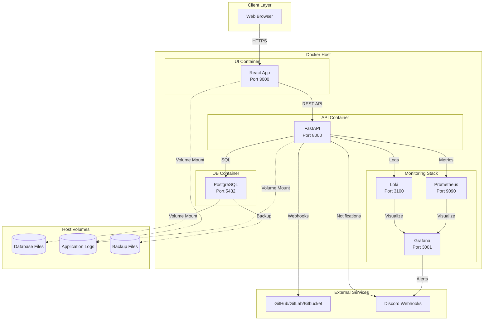
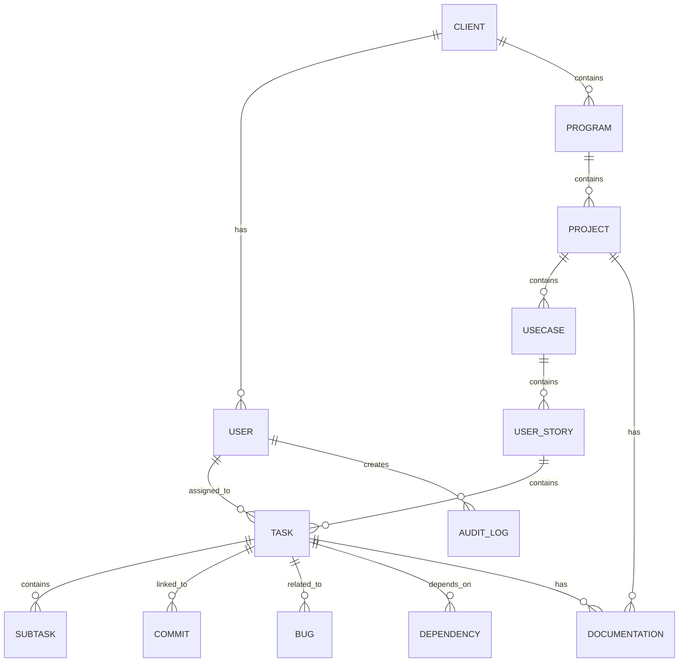
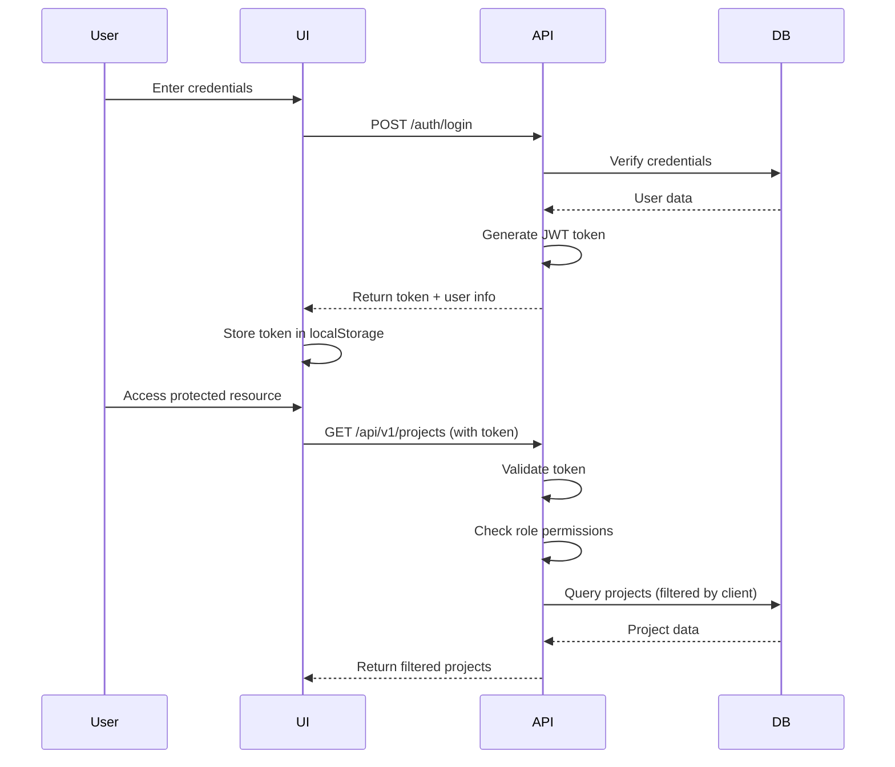

# Design Document

## Overview

Worky is a full-stack, containerized project management platform built using a modern microservices architecture. The system consists of three primary services (UI, API, DB) plus supporting infrastructure for monitoring, logging, and alerting. The architecture emphasizes security, scalability, observability, and maintainability through containerization, configuration management, and comprehensive monitoring.

### Key Design Principles

1. **Separation of Concerns**: UI, API, and database are isolated services
2. **Configuration as Code**: All parameters externalized to Ansible inventory files
3. **Data Persistence**: Logs, databases, and outputs stored on host volumes
4. **Security First**: TLS encryption, RBAC, audit logging, and secrets management
5. **Observability**: Comprehensive metrics, logs, and traces with alerting
6. **Agile Support**: Sprint boards, dependency tracking at all hierarchy levels

## Architecture

### High-Level Architecture



### Technology Stack

| Layer | Technology | Version | Purpose |
|-------|-----------|---------|---------|
| Frontend | React | 18+ | UI framework with hooks and context |
| Styling | Tailwind CSS | 3.x | Utility-first CSS with theme support |
| State Management | Zustand | 4.x | Lightweight state management |
| i18n | react-i18next | 13.x | Internationalization (English, Telugu) |
| Backend | FastAPI | 0.104+ | High-performance async Python API |
| ORM | SQLAlchemy | 2.x | Database ORM with async support |
| Database | PostgreSQL | 15+ | Relational database with JSONB support |
| Auth | python-jose | 3.x | JWT token generation and validation |
| Containerization | Docker | 24+ | Container runtime |
| Orchestration | Docker Compose | 2.x | Multi-container orchestration |
| Configuration | Ansible | 2.15+ | Infrastructure as code |
| Metrics | Prometheus | 2.47+ | Time-series metrics database |
| Visualization | Grafana | 10.x | Metrics and logs visualization |
| Logging | Loki | 2.9+ | Log aggregation system |
| Tracing | OpenTelemetry | 1.x | Distributed tracing |

## Components and Interfaces

### 1. UI Service (React Frontend)

**Directory Structure:**

```
ui/
├── public/
│   ├── locales/
│   │   ├── en/
│   │   │   └── translation.json
│   │   └── te/
│   │       └── translation.json
│   └── themes/
│       ├── snow.css
│       ├── greenery.css
│       ├── water.css
│       ├── dracula.css
│       ├── dark.css
│       └── blackwhite.css
├── src/
│   ├── components/
│   │   ├── common/
│   │   ├── hierarchy/
│   │   ├── planning/
│   │   │   ├── GanttChart.jsx
│   │   │   ├── KanbanBoard.jsx
│   │   │   └── SprintBoard.jsx
│   │   ├── git/
│   │   ├── documentation/
│   │   ├── bugs/
│   │   └── reports/
│   ├── contexts/
│   │   ├── AuthContext.jsx
│   │   ├── ThemeContext.jsx
│   │   └── LanguageContext.jsx
│   ├── hooks/
│   ├── services/
│   │   └── api.js
│   ├── stores/
│   ├── utils/
│   └── App.jsx
├── Dockerfile
└── package.json
```

**Key Features:**

- **Theme System**: Six themes with complete widget, font, and cursor customization
  - CSS variables for dynamic theming
  - Theme-specific cursor files
  - Font family switching per theme
  
- **Internationalization**: English and Telugu support using react-i18next
  - Language switcher in header
  - RTL support for Telugu if needed
  - Date/time formatting per locale

- **Planning Views**:
  - Gantt Chart: Timeline visualization with dependency lines (exportable to PDF/PNG)
  - Kanban Board: Drag-and-drop task management
  - Sprint Board: Agile sprint planning with burndown charts
  - Sequence Diagrams: Auto-generated from task flows (exportable)
  - Dependency Charts: Visual representation of entity dependencies (exportable)

- **API Integration**: Axios-based service layer with interceptors for auth tokens

**API Interface:**

```javascript
// Example API service structure
class APIService {
  constructor(baseURL) {
    this.client = axios.create({
      baseURL,
      headers: { 'Content-Type': 'application/json' }
    });
    
    // Add auth token to requests
    this.client.interceptors.request.use(config => {
      const token = localStorage.getItem('token');
      if (token) config.headers.Authorization = `Bearer ${token}`;
      return config;
    });
  }
  
  // Hierarchy endpoints
  async getClients() { return this.client.get('/api/v1/clients'); }
  async getProjects(clientId) { return this.client.get(`/api/v1/clients/${clientId}/projects`); }
  
  // Planning endpoints
  async getTasks(projectId) { return this.client.get(`/api/v1/projects/${projectId}/tasks`); }
  async updateTaskDependencies(taskId, dependencies) { 
    return this.client.put(`/api/v1/tasks/${taskId}/dependencies`, { dependencies }); 
  }
  
  // Git integration
  async getCommits(taskId) { return this.client.get(`/api/v1/tasks/${taskId}/commits`); }
}
```

### 2. API Service (FastAPI Backend)

**Directory Structure:**
```
api/
├── app/
│   ├── api/
│   │   └── v1/
│   │       ├── endpoints/
│   │       │   ├── auth.py
│   │       │   ├── clients.py
│   │       │   ├── programs.py
│   │       │   ├── projects.py
│   │       │   ├── usecases.py
│   │       │   ├── stories.py
│   │       │   ├── tasks.py
│   │       │   ├── bugs.py
│   │       │   ├── git.py
│   │       │   ├── documentation.py
│   │       │   └── reports.py
│   │       └── router.py
│   ├── core/
│   │   ├── config.py
│   │   ├── security.py
│   │   ├── logging.py
│   │   └── dependencies.py
│   ├── db/
│   │   ├── base.py
│   │   ├── session.py
│   │   └── init_db.py
│   ├── models/
│   │   ├── user.py
│   │   ├── client.py
│   │   ├── hierarchy.py
│   │   ├── bug.py
│   │   ├── git.py
│   │   └── audit.py
│   ├── schemas/
│   │   └── (Pydantic models)
│   ├── services/
│   │   ├── auth_service.py
│   │   ├── hierarchy_service.py
│   │   ├── git_service.py
│   │   ├── report_service.py
│   │   └── alert_service.py
│   ├── middleware/
│   │   ├── logging_middleware.py
│   │   ├── auth_middleware.py
│   │   └── metrics_middleware.py
│   └── main.py
├── tests/
├── Dockerfile
└── requirements.txt
```

**Key Features:**

- **Configuration Management**: All settings loaded from environment variables (populated by Ansible)

```python
# core/config.py
from pydantic_settings import BaseSettings

class Settings(BaseSettings):
    # Database (from Ansible inventory)
    DATABASE_HOST: str
    DATABASE_PORT: int
    DATABASE_NAME: str
    DATABASE_USER: str
    DATABASE_PASSWORD: str
    
    # Security
    SECRET_KEY: str
    ALGORITHM: str = "HS256"
    ACCESS_TOKEN_EXPIRE_MINUTES: int = 30
    
    # External services
    GITHUB_TOKEN: str
    GITLAB_TOKEN: str
    DISCORD_WEBHOOK_URL: str
    
    # Monitoring
    PROMETHEUS_PORT: int = 9090
    LOKI_URL: str
    
    class Config:
        env_file = ".env"
        case_sensitive = True

settings = Settings()
```

- **Authentication & Authorization**:
  - JWT-based authentication with refresh tokens
  - Role-based access control (RBAC) middleware
  - Client-based data filtering

```python
# core/security.py
from fastapi import Depends, HTTPException, status
from fastapi.security import OAuth2PasswordBearer
from jose import JWTError, jwt

oauth2_scheme = OAuth2PasswordBearer(tokenUrl="token")

async def get_current_user(token: str = Depends(oauth2_scheme)) -> User:
    credentials_exception = HTTPException(
        status_code=status.HTTP_401_UNAUTHORIZED,
        detail="Could not validate credentials"
    )
    try:
        payload = jwt.decode(token, settings.SECRET_KEY, algorithms=[settings.ALGORITHM])
        user_id: str = payload.get("sub")
        if user_id is None:
            raise credentials_exception
    except JWTError:
        raise credentials_exception
    
    user = await get_user_by_id(user_id)
    if user is None:
        raise credentials_exception
    return user

def require_role(allowed_roles: list[str]):
    async def role_checker(current_user: User = Depends(get_current_user)):
        if current_user.role not in allowed_roles:
            raise HTTPException(status_code=403, detail="Insufficient permissions")
        return current_user
    return role_checker
```

- **Structured Logging**:

```python
# core/logging.py
import logging
import json
from datetime import datetime
from contextvars import ContextVar

request_id_var: ContextVar[str] = ContextVar('request_id', default='')

class StructuredLogger:
    def __init__(self, service_name: str, env: str):
        self.service_name = service_name
        self.env = env
        self.logger = logging.getLogger(service_name)
    
    def log(self, level: str, message: str, **context):
        log_entry = {
            "timestamp": datetime.utcnow().isoformat() + "Z",
            "service": self.service_name,
            "env": self.env,
            "level": level,
            "request_id": request_id_var.get(),
            "message": message,
            "context": context
        }
        self.logger.log(getattr(logging, level), json.dumps(log_entry))

# Middleware to set request_id
from starlette.middleware.base import BaseHTTPMiddleware
import uuid

class LoggingMiddleware(BaseHTTPMiddleware):
    async def dispatch(self, request, call_next):
        request_id = str(uuid.uuid4())
        request_id_var.set(request_id)
        response = await call_next(request)
        response.headers["X-Request-ID"] = request_id
        return response
```

- **Metrics Collection**:
```python
# middleware/metrics_middleware.py
from prometheus_client import Counter, Histogram, generate_latest
import time

REQUEST_COUNT = Counter('http_requests_total', 'Total HTTP requests', ['method', 'endpoint', 'status'])
REQUEST_DURATION = Histogram('http_request_duration_seconds', 'HTTP request duration', ['method', 'endpoint'])

class MetricsMiddleware(BaseHTTPMiddleware):
    async def dispatch(self, request, call_next):
        start_time = time.time()
        response = await call_next(request)
        duration = time.time() - start_time
        
        REQUEST_COUNT.labels(
            method=request.method,
            endpoint=request.url.path,
            status=response.status_code
        ).inc()
        
        REQUEST_DURATION.labels(
            method=request.method,
            endpoint=request.url.path
        ).observe(duration)
        
        return response
```

### 3. Database Service (PostgreSQL)

**Directory Structure:**
```
db/
├── migrations/
│   └── versions/
├── schemas/
│   ├── 001_initial_schema.sql
│   ├── 002_audit_tables.sql
│   └── 003_indexes.sql
├── seeds/
│   └── dev_data.sql
├── backup/
│   └── backup.sh
└── Dockerfile
```

## Data Models

### Core Entity Relationships



### Key Tables

**users**

```sql
CREATE TABLE users (
    id UUID PRIMARY KEY DEFAULT gen_random_uuid(),
    email VARCHAR(255) UNIQUE NOT NULL,
    hashed_password VARCHAR(255) NOT NULL,
    full_name VARCHAR(255) NOT NULL,
    role VARCHAR(50) NOT NULL CHECK (role IN ('Admin', 'Project Manager', 'Product Owner', 'Developer', 'DevOps', 'Tester', 'Business Analyst')),
    client_id UUID NOT NULL REFERENCES clients(id) ON DELETE RESTRICT,
    language VARCHAR(10) DEFAULT 'en',
    theme VARCHAR(50) DEFAULT 'snow',
    is_active BOOLEAN DEFAULT true,
    created_at TIMESTAMP WITH TIME ZONE DEFAULT NOW(),
    updated_at TIMESTAMP WITH TIME ZONE DEFAULT NOW()
);

CREATE INDEX idx_users_client_id ON users(client_id);
CREATE INDEX idx_users_email ON users(email);
```

**clients**
```sql
CREATE TABLE clients (
    id UUID PRIMARY KEY DEFAULT gen_random_uuid(),
    name VARCHAR(255) NOT NULL,
    description TEXT,
    is_active BOOLEAN DEFAULT true,
    created_at TIMESTAMP WITH TIME ZONE DEFAULT NOW(),
    updated_at TIMESTAMP WITH TIME ZONE DEFAULT NOW()
);
```

**programs**
```sql
CREATE TABLE programs (
    id UUID PRIMARY KEY DEFAULT gen_random_uuid(),
    client_id UUID NOT NULL REFERENCES clients(id) ON DELETE CASCADE,
    name VARCHAR(255) NOT NULL,
    description TEXT,
    start_date DATE,
    end_date DATE,
    status VARCHAR(50) DEFAULT 'Planning',
    created_at TIMESTAMP WITH TIME ZONE DEFAULT NOW(),
    updated_at TIMESTAMP WITH TIME ZONE DEFAULT NOW()
);

CREATE INDEX idx_programs_client_id ON programs(client_id);
```

**projects**
```sql
CREATE TABLE projects (
    id UUID PRIMARY KEY DEFAULT gen_random_uuid(),
    program_id UUID NOT NULL REFERENCES programs(id) ON DELETE CASCADE,
    name VARCHAR(255) NOT NULL,
    description TEXT,
    start_date DATE,
    end_date DATE,
    status VARCHAR(50) DEFAULT 'Planning',
    repository_url VARCHAR(500),
    created_at TIMESTAMP WITH TIME ZONE DEFAULT NOW(),
    updated_at TIMESTAMP WITH TIME ZONE DEFAULT NOW()
);

CREATE INDEX idx_projects_program_id ON projects(program_id);
```

**tasks**
```sql
CREATE TABLE tasks (
    id UUID PRIMARY KEY DEFAULT gen_random_uuid(),
    user_story_id UUID NOT NULL REFERENCES user_stories(id) ON DELETE CASCADE,
    title VARCHAR(255) NOT NULL,
    description TEXT,
    status VARCHAR(50) DEFAULT 'To Do',
    priority VARCHAR(20) DEFAULT 'Medium',
    assigned_to UUID REFERENCES users(id) ON DELETE SET NULL,
    estimated_hours DECIMAL(10, 2),
    actual_hours DECIMAL(10, 2),
    start_date DATE,
    due_date DATE,
    completed_at TIMESTAMP WITH TIME ZONE,
    created_at TIMESTAMP WITH TIME ZONE DEFAULT NOW(),
    updated_at TIMESTAMP WITH TIME ZONE DEFAULT NOW()
);

CREATE INDEX idx_tasks_user_story_id ON tasks(user_story_id);
CREATE INDEX idx_tasks_assigned_to ON tasks(assigned_to);
CREATE INDEX idx_tasks_status ON tasks(status);
```

**dependencies**
```sql
CREATE TABLE dependencies (
    id UUID PRIMARY KEY DEFAULT gen_random_uuid(),
    entity_type VARCHAR(50) NOT NULL CHECK (entity_type IN ('Program', 'Project', 'Usecase', 'UserStory', 'Task', 'Subtask')),
    entity_id UUID NOT NULL,
    depends_on_type VARCHAR(50) NOT NULL,
    depends_on_id UUID NOT NULL,
    dependency_type VARCHAR(50) DEFAULT 'finish_to_start',
    created_at TIMESTAMP WITH TIME ZONE DEFAULT NOW()
);

CREATE INDEX idx_dependencies_entity ON dependencies(entity_type, entity_id);
CREATE INDEX idx_dependencies_depends_on ON dependencies(depends_on_type, depends_on_id);
```

**commits**

```sql
CREATE TABLE commits (
    id UUID PRIMARY KEY DEFAULT gen_random_uuid(),
    task_id UUID REFERENCES tasks(id) ON DELETE SET NULL,
    repository VARCHAR(255) NOT NULL,
    commit_hash VARCHAR(255) NOT NULL,
    author VARCHAR(255) NOT NULL,
    message TEXT NOT NULL,
    committed_at TIMESTAMP WITH TIME ZONE NOT NULL,
    branch VARCHAR(255),
    created_at TIMESTAMP WITH TIME ZONE DEFAULT NOW()
);

CREATE INDEX idx_commits_task_id ON commits(task_id);
CREATE INDEX idx_commits_hash ON commits(commit_hash);
```

**bugs**
```sql
CREATE TABLE bugs (
    id UUID PRIMARY KEY DEFAULT gen_random_uuid(),
    user_story_id UUID REFERENCES user_stories(id) ON DELETE SET NULL,
    task_id UUID REFERENCES tasks(id) ON DELETE SET NULL,
    title VARCHAR(255) NOT NULL,
    description TEXT NOT NULL,
    severity VARCHAR(20) NOT NULL CHECK (severity IN ('Critical', 'High', 'Medium', 'Low')),
    priority VARCHAR(20) NOT NULL CHECK (priority IN ('Urgent', 'High', 'Medium', 'Low')),
    status VARCHAR(50) DEFAULT 'New',
    assigned_to UUID REFERENCES users(id) ON DELETE SET NULL,
    reported_by UUID NOT NULL REFERENCES users(id),
    created_at TIMESTAMP WITH TIME ZONE DEFAULT NOW(),
    updated_at TIMESTAMP WITH TIME ZONE DEFAULT NOW(),
    closed_at TIMESTAMP WITH TIME ZONE
);

CREATE INDEX idx_bugs_status ON bugs(status);
CREATE INDEX idx_bugs_assigned_to ON bugs(assigned_to);
```

**audit_logs**
```sql
CREATE TABLE audit_logs (
    id UUID PRIMARY KEY DEFAULT gen_random_uuid(),
    user_id UUID REFERENCES users(id) ON DELETE SET NULL,
    client_id UUID REFERENCES clients(id) ON DELETE SET NULL,
    project_id UUID REFERENCES projects(id) ON DELETE SET NULL,
    action VARCHAR(100) NOT NULL,
    entity_type VARCHAR(50) NOT NULL,
    entity_id UUID NOT NULL,
    changes JSONB,
    request_id VARCHAR(100),
    ip_address INET,
    user_agent TEXT,
    created_at TIMESTAMP WITH TIME ZONE DEFAULT NOW()
);

CREATE INDEX idx_audit_logs_user_id ON audit_logs(user_id);
CREATE INDEX idx_audit_logs_entity ON audit_logs(entity_type, entity_id);
CREATE INDEX idx_audit_logs_created_at ON audit_logs(created_at);
```

**documentation**
```sql
CREATE TABLE documentation (
    id UUID PRIMARY KEY DEFAULT gen_random_uuid(),
    entity_type VARCHAR(50) NOT NULL,
    entity_id UUID NOT NULL,
    title VARCHAR(255) NOT NULL,
    content TEXT NOT NULL,
    version INTEGER DEFAULT 1,
    author_id UUID NOT NULL REFERENCES users(id),
    created_at TIMESTAMP WITH TIME ZONE DEFAULT NOW(),
    updated_at TIMESTAMP WITH TIME ZONE DEFAULT NOW()
);

CREATE INDEX idx_documentation_entity ON documentation(entity_type, entity_id);
```

## Error Handling

### Error Response Format

All API errors follow a consistent JSON structure:

```json
{
  "error": {
    "code": "RESOURCE_NOT_FOUND",
    "message": "Project with ID abc123 not found",
    "details": {
      "resource_type": "project",
      "resource_id": "abc123"
    },
    "request_id": "req_xyz789",
    "timestamp": "2025-11-11T10:00:00Z"
  }
}
```

### Error Categories

1. **Authentication Errors (401)**
   - Invalid token
   - Expired token
   - Missing credentials

2. **Authorization Errors (403)**
   - Insufficient permissions
   - Client data isolation violation

3. **Validation Errors (422)**
   - Invalid input data
   - Missing required fields
   - Constraint violations

4. **Not Found Errors (404)**
   - Resource does not exist

5. **Conflict Errors (409)**
   - Duplicate resource
   - Dependency constraint violation

6. **Server Errors (500)**
   - Database connection failure
   - External service unavailable

### Exception Handling Strategy


```python
# core/exceptions.py
from fastapi import HTTPException, Request
from fastapi.responses import JSONResponse
from datetime import datetime

class WorkyException(Exception):
    def __init__(self, code: str, message: str, status_code: int = 500, details: dict = None):
        self.code = code
        self.message = message
        self.status_code = status_code
        self.details = details or {}

async def worky_exception_handler(request: Request, exc: WorkyException):
    return JSONResponse(
        status_code=exc.status_code,
        content={
            "error": {
                "code": exc.code,
                "message": exc.message,
                "details": exc.details,
                "request_id": request.state.request_id,
                "timestamp": datetime.utcnow().isoformat() + "Z"
            }
        }
    )

# Register in main.py
app.add_exception_handler(WorkyException, worky_exception_handler)
```

## Testing Strategy

### Unit Tests

- **Coverage Target**: 80% minimum
- **Framework**: pytest with pytest-asyncio
- **Mocking**: unittest.mock for external services
- **Database**: pytest-postgresql for isolated test databases

```python
# tests/test_hierarchy_service.py
import pytest
from app.services.hierarchy_service import HierarchyService

@pytest.mark.asyncio
async def test_create_project_with_valid_data(db_session, test_client):
    service = HierarchyService(db_session)
    project_data = {
        "program_id": "valid-uuid",
        "name": "Test Project",
        "description": "Test description"
    }
    project = await service.create_project(project_data)
    assert project.name == "Test Project"
    assert project.status == "Planning"
```

### Integration Tests

- Test API endpoints end-to-end
- Verify database transactions
- Test authentication and authorization flows

```python
# tests/integration/test_project_api.py
@pytest.mark.asyncio
async def test_create_project_endpoint(client, auth_headers):
    response = await client.post(
        "/api/v1/projects",
        json={"program_id": "uuid", "name": "New Project"},
        headers=auth_headers
    )
    assert response.status_code == 201
    assert response.json()["name"] == "New Project"
```

### E2E Tests

- **Framework**: Playwright for UI testing
- **Scenarios**: Critical user journeys
  - User login and navigation
  - Create project with tasks
  - Link commits to tasks
  - Generate reports

### Performance Tests

- **Framework**: Locust for load testing
- **Targets**:
  - 300 concurrent users
  - 100 concurrent projects
  - API response time < 2s for 95th percentile

## Deployment Architecture

### Docker Compose Structure

```yaml
# docker-compose.yml
version: '3.8'

services:
  ui:
    build: ./ui
    ports:
      - "3000:3000"
    environment:
      - REACT_APP_API_URL=${API_URL}
    volumes:
      - ./volumes/ui-logs:/app/logs
    depends_on:
      - api
    networks:
      - worky-network

  api:
    build: ./api
    ports:
      - "8000:8000"
    environment:
      - DATABASE_HOST=${DATABASE_HOST}
      - DATABASE_PORT=${DATABASE_PORT}
      - DATABASE_NAME=${DATABASE_NAME}
      - DATABASE_USER=${DATABASE_USER}
      - DATABASE_PASSWORD=${DATABASE_PASSWORD}
      - SECRET_KEY=${SECRET_KEY}
      - GITHUB_TOKEN=${GITHUB_TOKEN}
      - DISCORD_WEBHOOK_URL=${DISCORD_WEBHOOK_URL}
    volumes:
      - ./volumes/api-logs:/app/logs
    depends_on:
      - db
    networks:
      - worky-network

  db:
    image: postgres:15
    environment:
      - POSTGRES_DB=${DATABASE_NAME}
      - POSTGRES_USER=${DATABASE_USER}
      - POSTGRES_PASSWORD=${DATABASE_PASSWORD}
    volumes:
      - ./volumes/postgres-data:/var/lib/postgresql/data
      - ./volumes/postgres-backups:/backups
    ports:
      - "5432:5432"
    networks:
      - worky-network

  prometheus:
    image: prom/prometheus:latest
    ports:
      - "9090:9090"
    volumes:
      - ./infra/prometheus/prometheus.yml:/etc/prometheus/prometheus.yml
      - ./volumes/prometheus-data:/prometheus
    networks:
      - worky-network

  grafana:
    image: grafana/grafana:latest
    ports:
      - "3001:3000"
    environment:
      - GF_SECURITY_ADMIN_PASSWORD=${GRAFANA_ADMIN_PASSWORD}
    volumes:
      - ./infra/grafana/dashboards:/etc/grafana/provisioning/dashboards
      - ./volumes/grafana-data:/var/lib/grafana
    depends_on:
      - prometheus
    networks:
      - worky-network

  loki:
    image: grafana/loki:latest
    ports:
      - "3100:3100"
    volumes:
      - ./infra/loki/loki-config.yml:/etc/loki/local-config.yaml
      - ./volumes/loki-data:/loki
    networks:
      - worky-network

networks:
  worky-network:
    driver: bridge

volumes:
  postgres-data:
  postgres-backups:
  api-logs:
  ui-logs:
  prometheus-data:
  grafana-data:
  loki-data:
```

### Ansible Configuration

**Inventory Structure:**


```ini
# infra/ansible/inventory/production.ini
[worky_servers]
worky-prod-01 ansible_host=192.168.1.100 ansible_user=deploy

[worky_servers:vars]
# Database Configuration
DATABASE_HOST=db
DATABASE_PORT=5432
DATABASE_NAME=worky_prod
DATABASE_USER=worky_user
DATABASE_PASSWORD={{ vault_database_password }}

# API Configuration
API_URL=https://api.worky.datalegos.com
SECRET_KEY={{ vault_secret_key }}
ACCESS_TOKEN_EXPIRE_MINUTES=30

# External Services
GITHUB_TOKEN={{ vault_github_token }}
GITLAB_TOKEN={{ vault_gitlab_token }}
DISCORD_WEBHOOK_URL={{ vault_discord_webhook }}

# Monitoring
PROMETHEUS_PORT=9090
GRAFANA_ADMIN_PASSWORD={{ vault_grafana_password }}

# Application Settings
ENVIRONMENT=production
LOG_LEVEL=INFO
```

**Playbook Structure:**
```yaml
# infra/ansible/playbooks/deploy.yml
---
- name: Deploy Worky Platform
  hosts: worky_servers
  become: yes
  
  vars_files:
    - ../vault/secrets.yml
  
  tasks:
    - name: Install Docker
      include_role:
        name: docker
    
    - name: Create volume directories
      file:
        path: "{{ item }}"
        state: directory
        mode: '0755'
      loop:
        - /opt/worky/volumes/postgres-data
        - /opt/worky/volumes/postgres-backups
        - /opt/worky/volumes/api-logs
        - /opt/worky/volumes/ui-logs
        - /opt/worky/volumes/prometheus-data
        - /opt/worky/volumes/grafana-data
        - /opt/worky/volumes/loki-data
    
    - name: Copy docker-compose file
      template:
        src: ../templates/docker-compose.yml.j2
        dest: /opt/worky/docker-compose.yml
    
    - name: Create .env file from inventory
      template:
        src: ../templates/env.j2
        dest: /opt/worky/.env
        mode: '0600'
    
    - name: Pull Docker images
      command: docker-compose pull
      args:
        chdir: /opt/worky
    
    - name: Start services
      command: docker-compose up -d
      args:
        chdir: /opt/worky
    
    - name: Wait for API to be healthy
      uri:
        url: "http://localhost:8000/health"
        status_code: 200
      register: result
      until: result.status == 200
      retries: 30
      delay: 10
```

### CI/CD Pipeline

```yaml
# .github/workflows/deploy.yml
name: Build and Deploy Worky

on:
  push:
    branches: [main, develop]
  pull_request:
    branches: [main]

jobs:
  test-api:
    runs-on: ubuntu-latest
    steps:
      - uses: actions/checkout@v3
      
      - name: Set up Python
        uses: actions/setup-python@v4
        with:
          python-version: '3.11'
      
      - name: Install dependencies
        run: |
          cd api
          pip install -r requirements.txt
          pip install pytest pytest-asyncio pytest-cov
      
      - name: Run tests
        run: |
          cd api
          pytest --cov=app --cov-report=xml
      
      - name: Upload coverage
        uses: codecov/codecov-action@v3

  test-ui:
    runs-on: ubuntu-latest
    steps:
      - uses: actions/checkout@v3
      
      - name: Set up Node.js
        uses: actions/setup-node@v3
        with:
          node-version: '18'
      
      - name: Install dependencies
        run: |
          cd ui
          npm ci
      
      - name: Run tests
        run: |
          cd ui
          npm test -- --coverage

  security-scan:
    runs-on: ubuntu-latest
    steps:
      - uses: actions/checkout@v3
      
      - name: Run Trivy vulnerability scanner
        uses: aquasecurity/trivy-action@master
        with:
          scan-type: 'fs'
          scan-ref: '.'
          format: 'sarif'
          output: 'trivy-results.sarif'
      
      - name: Upload Trivy results to GitHub Security
        uses: github/codeql-action/upload-sarif@v2
        with:
          sarif_file: 'trivy-results.sarif'

  build-and-push:
    needs: [test-api, test-ui, security-scan]
    runs-on: ubuntu-latest
    if: github.ref == 'refs/heads/main'
    
    steps:
      - uses: actions/checkout@v3
      
      - name: Set up Docker Buildx
        uses: docker/setup-buildx-action@v2
      
      - name: Build API image
        run: |
          cd api
          docker build -t worky-api:${{ github.sha }} .
      
      - name: Build UI image
        run: |
          cd ui
          docker build -t worky-ui:${{ github.sha }} .
      
      - name: Scan images with Trivy
        run: |
          trivy image worky-api:${{ github.sha }}
          trivy image worky-ui:${{ github.sha }}

  deploy:
    needs: build-and-push
    runs-on: ubuntu-latest
    if: github.ref == 'refs/heads/main'
    
    steps:
      - uses: actions/checkout@v3
      
      - name: Install Ansible
        run: |
          pip install ansible
      
      - name: Deploy with Ansible
        run: |
          cd infra/ansible
          ansible-playbook -i inventory/production.ini playbooks/deploy.yml
        env:
          ANSIBLE_VAULT_PASSWORD: ${{ secrets.ANSIBLE_VAULT_PASSWORD }}
```

## Monitoring and Observability

### Prometheus Metrics

**Custom Application Metrics:**


```python
# Metrics definitions
from prometheus_client import Counter, Histogram, Gauge

# Request metrics
http_requests_total = Counter(
    'http_requests_total',
    'Total HTTP requests',
    ['method', 'endpoint', 'status']
)

http_request_duration_seconds = Histogram(
    'http_request_duration_seconds',
    'HTTP request duration',
    ['method', 'endpoint']
)

# Business metrics
tasks_created_total = Counter('tasks_created_total', 'Total tasks created', ['project_id'])
tasks_completed_total = Counter('tasks_completed_total', 'Total tasks completed', ['project_id'])
bugs_reported_total = Counter('bugs_reported_total', 'Total bugs reported', ['severity'])
commits_linked_total = Counter('commits_linked_total', 'Total commits linked to tasks')

# System metrics
active_users = Gauge('active_users', 'Number of active users')
active_projects = Gauge('active_projects', 'Number of active projects')
database_connections = Gauge('database_connections', 'Number of database connections')
```

### Grafana Dashboards

**Dashboard 1: System Health**
- API request rate and latency
- Error rate by endpoint
- Database connection pool usage
- Container resource usage (CPU, memory)

**Dashboard 2: Business Metrics**
- Tasks created vs completed (trend)
- Bug density by project
- Developer activity (commits per day)
- Sprint burndown charts

**Dashboard 3: User Activity**
- Active users by role
- Most active projects
- Documentation updates
- Git integration activity

### Alert Rules

```yaml
# infra/prometheus/alerts.yml
groups:
  - name: worky_alerts
    interval: 30s
    rules:
      - alert: HighErrorRate
        expr: rate(http_requests_total{status=~"5.."}[5m]) > 0.05
        for: 5m
        labels:
          severity: critical
        annotations:
          summary: "High error rate detected"
          description: "Error rate is {{ $value }} errors/sec"
      
      - alert: SlowAPIResponse
        expr: histogram_quantile(0.95, http_request_duration_seconds) > 2
        for: 10m
        labels:
          severity: warning
        annotations:
          summary: "API response time is slow"
          description: "95th percentile response time is {{ $value }}s"
      
      - alert: DatabaseConnectionPoolExhausted
        expr: database_connections > 90
        for: 5m
        labels:
          severity: critical
        annotations:
          summary: "Database connection pool nearly exhausted"
      
      - alert: BackupFailed
        expr: time() - last_backup_timestamp > 86400
        for: 1h
        labels:
          severity: critical
        annotations:
          summary: "Database backup has not run in 24 hours"
```

### Discord Alert Integration

```python
# services/alert_service.py
import aiohttp
from core.config import settings

class AlertService:
    def __init__(self):
        self.webhook_url = settings.DISCORD_WEBHOOK_URL
    
    async def send_alert(self, title: str, message: str, severity: str = "info"):
        color_map = {
            "info": 3447003,      # Blue
            "warning": 16776960,  # Yellow
            "critical": 15158332  # Red
        }
        
        payload = {
            "embeds": [{
                "title": title,
                "description": message,
                "color": color_map.get(severity, 3447003),
                "timestamp": datetime.utcnow().isoformat()
            }]
        }
        
        async with aiohttp.ClientSession() as session:
            await session.post(self.webhook_url, json=payload)
```

## Security Architecture

### Authentication Flow



### Data Encryption

1. **In Transit**: TLS 1.3 for all HTTP communication
2. **At Rest**: 
   - Database column encryption for sensitive fields (passwords, tokens)
   - Encrypted backups using GPG
3. **Secrets Management**: Ansible Vault for configuration secrets

### Access Control Matrix

| Role | Create Project | View All Clients | Manage Users | Link Commits | Create Bugs | View Reports |
|------|---------------|------------------|--------------|--------------|-------------|--------------|
| Admin | ✓ | ✓ | ✓ | ✓ | ✓ | ✓ |
| Project Manager | ✓ | ✗ | ✗ | ✗ | ✓ | ✓ |
| Product Owner | ✗ | ✗ | ✗ | ✗ | ✓ | ✓ |
| Developer | ✗ | ✗ | ✗ | ✓ | ✓ | ✗ |
| DevOps | ✗ | ✗ | ✗ | ✓ | ✓ | ✓ |
| Tester | ✗ | ✗ | ✗ | ✗ | ✓ | ✗ |
| Business Analyst | ✗ | ✗ | ✗ | ✗ | ✗ | ✓ |

## Git Integration Design

### Webhook Processing

```python
# api/v1/endpoints/git.py
from fastapi import APIRouter, BackgroundTasks

router = APIRouter()

@router.post("/webhooks/github")
async def github_webhook(payload: dict, background_tasks: BackgroundTasks):
    if payload.get("action") == "closed" and payload.get("pull_request", {}).get("merged"):
        pr = payload["pull_request"]
        background_tasks.add_task(process_merged_pr, pr)
    
    return {"status": "received"}

async def process_merged_pr(pr: dict):
    # Extract task IDs from PR title/body
    task_ids = extract_task_ids(pr["title"] + " " + pr["body"])
    
    for task_id in task_ids:
        # Update task status
        await update_task_status(task_id, "Done")
        
        # Link commits
        for commit in pr["commits"]:
            await link_commit_to_task(task_id, commit)
```

### Commit Parsing

```python
# services/git_service.py
import re

class GitService:
    TASK_PATTERN = re.compile(r'#TASK-(\d+)')
    BUG_PATTERN = re.compile(r'#BUG-(\d+)')
    
    def extract_task_ids(self, message: str) -> list[str]:
        return self.TASK_PATTERN.findall(message)
    
    def extract_bug_ids(self, message: str) -> list[str]:
        return self.BUG_PATTERN.findall(message)
    
    async def process_commit(self, commit_data: dict):
        message = commit_data["message"]
        
        # Link to tasks
        task_ids = self.extract_task_ids(message)
        for task_id in task_ids:
            await self.link_commit(commit_data, "task", task_id)
        
        # Auto-close bugs
        bug_ids = self.extract_bug_ids(message)
        for bug_id in bug_ids:
            if "fixes" in message.lower() or "closes" in message.lower():
                await self.close_bug(bug_id)
```

## Theme System Design

### CSS Variable Structure

```css
/* public/themes/snow.css */
:root {
  /* Colors */
  --primary-color: #4A90E2;
  --secondary-color: #F5F7FA;
  --text-color: #2C3E50;
  --background-color: #FFFFFF;
  --border-color: #E1E8ED;
  
  /* Fonts */
  --font-family: 'Inter', sans-serif;
  --font-size-base: 14px;
  --font-weight-normal: 400;
  --font-weight-bold: 600;
  
  /* Cursors */
  --cursor-default: url('/cursors/snow-default.cur'), auto;
  --cursor-pointer: url('/cursors/snow-pointer.cur'), pointer;
  
  /* Spacing */
  --spacing-xs: 4px;
  --spacing-sm: 8px;
  --spacing-md: 16px;
  --spacing-lg: 24px;
}
```

### Theme Switcher Component

```jsx
// src/components/ThemeSwitcher.jsx
import { useContext } from 'react';
import { ThemeContext } from '../contexts/ThemeContext';

const themes = [
  { id: 'snow', name: 'Snow', icon: '❄️' },
  { id: 'greenery', name: 'Greenery', icon: '🌿' },
  { id: 'water', name: 'Water', icon: '💧' },
  { id: 'dracula', name: 'Dracula', icon: '🧛' },
  { id: 'dark', name: 'Dark', icon: '🌙' },
  { id: 'blackwhite', name: 'B&W', icon: '⚫' }
];

export function ThemeSwitcher() {
  const { theme, setTheme } = useContext(ThemeContext);
  
  const handleThemeChange = async (newTheme) => {
    setTheme(newTheme);
    // Persist to backend
    await api.updateUserPreferences({ theme: newTheme });
  };
  
  return (
    <div className="theme-switcher">
      {themes.map(t => (
        <button
          key={t.id}
          onClick={() => handleThemeChange(t.id)}
          className={theme === t.id ? 'active' : ''}
        >
          {t.icon} {t.name}
        </button>
      ))}
    </div>
  );
}
```

## Performance Optimization

### Database Optimization

1. **Indexing Strategy**: Indexes on foreign keys, frequently queried columns
2. **Connection Pooling**: SQLAlchemy pool size: 20, max overflow: 10
3. **Query Optimization**: Use eager loading for relationships, avoid N+1 queries
4. **Caching**: Redis for frequently accessed data (user sessions, project metadata)

### API Optimization

1. **Pagination**: Default page size 50, max 100
2. **Field Selection**: Allow clients to specify required fields
3. **Compression**: Gzip compression for responses > 1KB
4. **Rate Limiting**: 100 requests per minute per user

### Frontend Optimization

1. **Code Splitting**: Lazy load routes and heavy components
2. **Asset Optimization**: Image compression, SVG icons
3. **Caching**: Service worker for offline support
4. **Virtual Scrolling**: For large lists (tasks, commits)

## Backup and Recovery

### Backup Strategy

```bash
#!/bin/bash
# db/backup/backup.sh

BACKUP_DIR="/backups"
TIMESTAMP=$(date +%Y%m%d_%H%M%S)
BACKUP_FILE="worky_backup_${TIMESTAMP}.sql.gz"

# Create backup
pg_dump -U $POSTGRES_USER $POSTGRES_DB | gzip > "${BACKUP_DIR}/${BACKUP_FILE}"

# Encrypt backup
gpg --encrypt --recipient backup@datalegos.com "${BACKUP_DIR}/${BACKUP_FILE}"

# Upload to remote storage (S3, etc.)
# aws s3 cp "${BACKUP_DIR}/${BACKUP_FILE}.gpg" s3://worky-backups/

# Cleanup old backups (keep 30 days hot, 180 days cold)
find ${BACKUP_DIR} -name "worky_backup_*.sql.gz.gpg" -mtime +30 -delete
```

### Recovery Procedure

1. Stop application containers
2. Restore database from backup
3. Verify data integrity
4. Restart containers
5. Run smoke tests

## Design Decisions and Rationales

### Why FastAPI over Flask/Django?
- Async support for better concurrency
- Automatic API documentation (OpenAPI/Swagger)
- Type hints and Pydantic validation
- Better performance for I/O-bound operations

### Why PostgreSQL over MySQL/MongoDB?
- JSONB support for flexible schema
- Strong ACID compliance
- Better support for complex queries
- Mature ecosystem

### Why Tailwind CSS?
- Rapid development with utility classes
- Easy theme customization via CSS variables
- Smaller bundle size with PurgeCSS
- Consistent design system

### Why Zustand over Redux?
- Simpler API, less boilerplate
- Better TypeScript support
- Smaller bundle size
- Sufficient for application complexity

### Why Docker Compose over Kubernetes?
- Simpler for internal deployment
- Lower operational overhead
- Sufficient for 300 users
- Can migrate to K8s if needed

This design provides a solid foundation for building Worky as a secure, scalable, and maintainable project management platform.


## Chart Generation and Export

### Gantt Chart Generation

**Library**: react-gantt-chart or custom D3.js implementation

```jsx
// src/components/planning/GanttChart.jsx
import { Gantt } from 'react-gantt-chart';
import html2canvas from 'html2canvas';
import jsPDF from 'jspdf';

export function GanttChart({ tasks, dependencies }) {
  const ganttRef = useRef(null);
  
  const exportToPDF = async () => {
    const canvas = await html2canvas(ganttRef.current);
    const imgData = canvas.toDataURL('image/png');
    const pdf = new jsPDF('landscape');
    pdf.addImage(imgData, 'PNG', 10, 10, 280, 180);
    pdf.save(`gantt-chart-${Date.now()}.pdf`);
  };
  
  const exportToPNG = async () => {
    const canvas = await html2canvas(ganttRef.current);
    const link = document.createElement('a');
    link.download = `gantt-chart-${Date.now()}.png`;
    link.href = canvas.toDataURL();
    link.click();
  };
  
  return (
    <div>
      <div className="export-buttons">
        <button onClick={exportToPDF}>Export to PDF</button>
        <button onClick={exportToPNG}>Export to PNG</button>
      </div>
      <div ref={ganttRef}>
        <Gantt
          tasks={tasks}
          dependencies={dependencies}
          viewMode="Day"
        />
      </div>
    </div>
  );
}
```

### Dependency Chart Generation

**Library**: Mermaid.js for diagram generation

```jsx
// src/components/planning/DependencyChart.jsx
import mermaid from 'mermaid';
import { useEffect, useRef } from 'react';

export function DependencyChart({ entities, dependencies }) {
  const chartRef = useRef(null);
  
  useEffect(() => {
    mermaid.initialize({ startOnLoad: true, theme: 'default' });
    
    // Generate Mermaid syntax
    const mermaidCode = generateMermaidDependencyGraph(entities, dependencies);
    
    mermaid.render('dependency-chart', mermaidCode).then(({ svg }) => {
      chartRef.current.innerHTML = svg;
    });
  }, [entities, dependencies]);
  
  const generateMermaidDependencyGraph = (entities, deps) => {
    let code = 'graph TD\n';
    
    entities.forEach(entity => {
      code += `  ${entity.id}["${entity.name}"]\n`;
    });
    
    deps.forEach(dep => {
      code += `  ${dep.entity_id} -->|${dep.dependency_type}| ${dep.depends_on_id}\n`;
    });
    
    return code;
  };
  
  const exportToSVG = () => {
    const svgData = chartRef.current.innerHTML;
    const blob = new Blob([svgData], { type: 'image/svg+xml' });
    const url = URL.createObjectURL(blob);
    const link = document.createElement('a');
    link.download = `dependency-chart-${Date.now()}.svg`;
    link.href = url;
    link.click();
  };
  
  const exportToPDF = async () => {
    const canvas = await html2canvas(chartRef.current);
    const imgData = canvas.toDataURL('image/png');
    const pdf = new jsPDF();
    pdf.addImage(imgData, 'PNG', 10, 10, 190, 0);
    pdf.save(`dependency-chart-${Date.now()}.pdf`);
  };
  
  return (
    <div>
      <div className="export-buttons">
        <button onClick={exportToSVG}>Export to SVG</button>
        <button onClick={exportToPDF}>Export to PDF</button>
      </div>
      <div ref={chartRef} className="dependency-chart"></div>
    </div>
  );
}
```

### Sequence Diagram Generation

**API Endpoint for Sequence Generation:**

```python
# api/v1/endpoints/diagrams.py
from fastapi import APIRouter, Depends
from app.services.diagram_service import DiagramService

router = APIRouter()

@router.get("/projects/{project_id}/sequence-diagram")
async def generate_sequence_diagram(
    project_id: str,
    format: str = "mermaid",
    current_user: User = Depends(get_current_user)
):
    """
    Generate sequence diagram from task flow
    Supports formats: mermaid, plantuml, svg, pdf
    """
    service = DiagramService()
    
    # Get tasks and their relationships
    tasks = await get_project_tasks(project_id)
    
    # Generate diagram code
    if format == "mermaid":
        diagram_code = service.generate_mermaid_sequence(tasks)
        return {"code": diagram_code, "format": "mermaid"}
    
    elif format == "svg":
        svg_content = await service.render_to_svg(tasks)
        return Response(content=svg_content, media_type="image/svg+xml")
    
    elif format == "pdf":
        pdf_content = await service.render_to_pdf(tasks)
        return Response(
            content=pdf_content,
            media_type="application/pdf",
            headers={"Content-Disposition": f"attachment; filename=sequence-{project_id}.pdf"}
        )
```

**Diagram Service:**

```python
# services/diagram_service.py
import subprocess
from typing import List
from app.models.hierarchy import Task

class DiagramService:
    def generate_mermaid_sequence(self, tasks: List[Task]) -> str:
        """Generate Mermaid sequence diagram from tasks"""
        code = "sequenceDiagram\n"
        
        # Group tasks by assigned user
        actors = set(task.assigned_to.full_name for task in tasks if task.assigned_to)
        
        for actor in actors:
            code += f"    participant {actor}\n"
        
        # Add task interactions
        for task in sorted(tasks, key=lambda t: t.created_at):
            if task.assigned_to:
                code += f"    {task.assigned_to.full_name}->>System: {task.title}\n"
                if task.status == "Done":
                    code += f"    System-->{task.assigned_to.full_name}: Completed\n"
        
        return code
    
    async def render_to_svg(self, tasks: List[Task]) -> bytes:
        """Render sequence diagram to SVG using mermaid-cli"""
        mermaid_code = self.generate_mermaid_sequence(tasks)
        
        # Write to temp file
        with open('/tmp/diagram.mmd', 'w') as f:
            f.write(mermaid_code)
        
        # Render using mermaid-cli
        subprocess.run([
            'mmdc',
            '-i', '/tmp/diagram.mmd',
            '-o', '/tmp/diagram.svg',
            '-t', 'default'
        ])
        
        with open('/tmp/diagram.svg', 'rb') as f:
            return f.read()
    
    async def render_to_pdf(self, tasks: List[Task]) -> bytes:
        """Render sequence diagram to PDF"""
        svg_content = await self.render_to_svg(tasks)
        
        # Convert SVG to PDF using cairosvg
        import cairosvg
        pdf_content = cairosvg.svg2pdf(bytestring=svg_content)
        
        return pdf_content
```

**Frontend Component:**

```jsx
// src/components/planning/SequenceDiagram.jsx
import { useState, useEffect } from 'react';
import mermaid from 'mermaid';

export function SequenceDiagram({ projectId }) {
  const [diagramCode, setDiagramCode] = useState('');
  const [loading, setLoading] = useState(true);
  
  useEffect(() => {
    loadDiagram();
  }, [projectId]);
  
  const loadDiagram = async () => {
    const response = await api.get(`/api/v1/projects/${projectId}/sequence-diagram`);
    setDiagramCode(response.data.code);
    
    mermaid.initialize({ startOnLoad: true });
    mermaid.contentLoaded();
    setLoading(false);
  };
  
  const exportToPDF = async () => {
    const response = await api.get(
      `/api/v1/projects/${projectId}/sequence-diagram?format=pdf`,
      { responseType: 'blob' }
    );
    
    const url = window.URL.createObjectURL(new Blob([response.data]));
    const link = document.createElement('a');
    link.href = url;
    link.setAttribute('download', `sequence-diagram-${projectId}.pdf`);
    document.body.appendChild(link);
    link.click();
    link.remove();
  };
  
  const exportToSVG = async () => {
    const response = await api.get(
      `/api/v1/projects/${projectId}/sequence-diagram?format=svg`,
      { responseType: 'blob' }
    );
    
    const url = window.URL.createObjectURL(new Blob([response.data]));
    const link = document.createElement('a');
    link.href = url;
    link.setAttribute('download', `sequence-diagram-${projectId}.svg`);
    document.body.appendChild(link);
    link.click();
    link.remove();
  };
  
  if (loading) return <div>Loading diagram...</div>;
  
  return (
    <div>
      <div className="export-buttons">
        <button onClick={exportToPDF}>Export to PDF</button>
        <button onClick={exportToSVG}>Export to SVG</button>
      </div>
      <div className="mermaid">
        {diagramCode}
      </div>
    </div>
  );
}
```

### Chart Export API Endpoints

```python
# api/v1/endpoints/exports.py
from fastapi import APIRouter, Depends, Response
from fastapi.responses import StreamingResponse
import io

router = APIRouter()

@router.get("/projects/{project_id}/gantt/export")
async def export_gantt_chart(
    project_id: str,
    format: str = "pdf",  # pdf, png, svg
    current_user: User = Depends(get_current_user)
):
    """Export Gantt chart in specified format"""
    service = ChartExportService()
    
    tasks = await get_project_tasks_with_dependencies(project_id)
    
    if format == "pdf":
        content = await service.generate_gantt_pdf(tasks)
        media_type = "application/pdf"
        filename = f"gantt-{project_id}.pdf"
    elif format == "png":
        content = await service.generate_gantt_png(tasks)
        media_type = "image/png"
        filename = f"gantt-{project_id}.png"
    elif format == "svg":
        content = await service.generate_gantt_svg(tasks)
        media_type = "image/svg+xml"
        filename = f"gantt-{project_id}.svg"
    
    return Response(
        content=content,
        media_type=media_type,
        headers={"Content-Disposition": f"attachment; filename={filename}"}
    )

@router.get("/dependencies/export")
async def export_dependency_chart(
    entity_type: str,
    entity_id: str,
    format: str = "pdf",
    current_user: User = Depends(get_current_user)
):
    """Export dependency chart for any entity"""
    service = ChartExportService()
    
    dependencies = await get_entity_dependencies(entity_type, entity_id)
    
    if format == "pdf":
        content = await service.generate_dependency_pdf(dependencies)
        media_type = "application/pdf"
        filename = f"dependencies-{entity_id}.pdf"
    elif format == "svg":
        content = await service.generate_dependency_svg(dependencies)
        media_type = "image/svg+xml"
        filename = f"dependencies-{entity_id}.svg"
    
    return Response(
        content=content,
        media_type=media_type,
        headers={"Content-Disposition": f"attachment; filename={filename}"}
    )
```

### Required Dependencies

**UI Package.json additions:**
```json
{
  "dependencies": {
    "react-gantt-chart": "^1.0.0",
    "mermaid": "^10.6.0",
    "html2canvas": "^1.4.1",
    "jspdf": "^2.5.1",
    "d3": "^7.8.5"
  }
}
```

**API Requirements.txt additions:**
```
cairosvg==2.7.1
pillow==10.1.0
reportlab==4.0.7
```

This design ensures all charts (Gantt, Dependency, Sequence) can be generated dynamically and exported in multiple formats (PDF, PNG, SVG) for documentation and reporting purposes.
